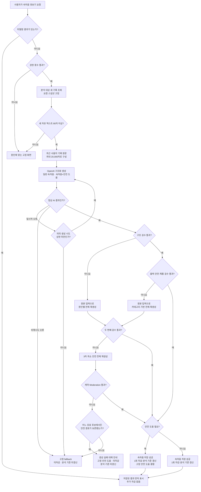

# Pebbling AI 개발 인계 · v1

## 최신 추가 수정 요청 — 2026-07-30

현재 `feature/venting-tab`의 `3a5cd9c` 구현을 기준으로 바꿀 내용만 전달할 때는
아래 두 문서를 사용한다.

1. 실제 앱·서버:
   [속마음 운영 안전·복구 추가 수정 요청](속마음-운영-안전-복구-추가수정요청.md)
2. 내부 테스트 도구:
   [Prompt Lab 안전·복구 추가 수정 요청](Prompt-Lab-안전-복구-추가수정요청.md)
3. 전체 실행 플로우와 분기 정의:
   [앱·서버 변경요청서의 0.1·0.2](속마음-운영-안전-복구-추가수정요청.md#01-전체-처리-플로우--구현-분기의-단일-기준)

> **프롬프트 재설계 HOLD**
>
> 현재 개발자에게 확정 전달하는 범위는 코드 출력 계약, 시도 이력, Moderation,
> 최대 3회 실행 슬롯, fallback 상태, 로그·보관 구조다. 운영 프롬프트 본문,
> few-shot, 2·3차 생성 지시문, 문체·품질 평가 루브릭, 운영 기본 모델과 fallback
> 최종 카피는 전면 재설계 후 별도 전달한다. 기존 프롬프트를 기준으로 추정 구현하지
> 않는다. PPT는 구조 이해용 스냅샷이며 이후 구현 기준으로 갱신하지 않는다.

두 문서는 서로 다른 작업 범위다. 기존
[`Prompt-Lab-v0.5.0-수정요청.md`](Prompt-Lab-v0.5.0-수정요청.md)는 이전 구현
기준이므로 현재 개발 작업지시로 사용하지 않는다. 아래의 기존 구현·검증 문서는
제품 배경과 전체 계약을 확인하는 참고자료로만 함께 사용한다.

이 폴더가 외주개발자에게 전달하는 **유일한 AI 개발 기준**이다. 다른 폴더의 기획·리서치·과거 문서는 이번 구현을 위해 읽지 않아도 된다.

> **기존 인계 묶음 기준:** `feature/venting-tab`의
> `fba64161d4f8ba5c78fedc8d5ec2c34416e55b66`
>
> **현재 추가 수정 기준:** `feature/venting-tab`의 `3a5cd9c`. 이번 작업에서는
> 위의 최신 추가 수정 요청 두 문서를 우선하고, 기존 인계 묶음은 배경과 원래 계약을
> 확인할 때만 참고한다.
> v0.4.x 기반 구현이 상당 부분 완료됐지만,
> 프롬프트·Prompt Lab 평가 계약·최신 안전 정책은 아직 v0.5.0과 일치하지
> 않는다. 아래 문서의 **남은 변경만** 구현한다.

### 현재 코드에서 이미 확인된 기반

- 분석 대상 기록 80자 게이트, 최근 24시간 조회, 요청 스냅샷과 20,000자 입력 구성
- `THOUGHT | THOUGHT_WITH_SAFETY_SUPPORT` 구조화 출력과 기존 말풍선 3~7개 검수
- 기존 말풍선당 90자·전체 420자·질문 수·직접 식별정보 반복 검사
- OpenAI 출력 Moderation
- 일반 속마음과 속마음+안전 도움의 공통 저장·차감·분석 기준 갱신 경로
- 일시적 OpenAI 오류의 동일 요청 최대 1회 재시도
- CSV 평가 시나리오 240개와 Google Sheets 실행별 결과·기획 검수 시트

### 이번 인계에서 실제로 남은 핵심

- 운영과 Prompt Lab이 같은 프롬프트 버전을 선택할 수 있는 구조를 유지한다.
  새 운영 프롬프트 본문과 버전은 재설계 후 별도 전달한다.
- Prompt Lab에 남은 `safety_only | SAFETY_ONLY`를 제거한다.
- 전달 CSV의 안전 관련 24개 변경 행을 반영해 최종 분포를
  `generate_standard 217 / generate_with_safety_support 22 /
  server_no_call 1`로 맞춘다.
- 구조·출력 안전·제품 검수 실패의 최대 3회 실행 슬롯과 최종 실패 상태를
  명세대로 완성하고 모의 응답 자동 테스트 증거를 남긴다. 각 슬롯의 실제
  프롬프트 지시문은 HOLD한다.
- 코드의 출력 안전망을 말풍선 1~20개·개별 300자·전체 3,000자로 넓히고,
  질문 수는 기계적 실패 기준에서 제외한다.
- 답변 생성은 최대 3회로 통일하되 각 시도의 프롬프트는 설정으로 교체 가능하게 한다.
- 모델도 설정으로 교체 가능하게 유지하며 운영 기본 모델 확정은 HOLD한다.

## 1. 무엇을 만드는가

사용자가 `속마음 엿보기`를 직접 요청하면, 돌멩이가 최근 기록을 읽고 짧은 혼잣말을 만든다.

- 기록할 때마다 답하는 실시간 챗봇이 아니다.
- 상담·진단·문제 해결 기능이 아니다.
- 사용자가 나중에 돌멩이의 생각을 엿보는 기능이다.
- 정확하고 안전해야 하며, 기록을 단순 요약하는 따분한 결과도 품질 실패다.

이번 인계 범위는 **AI로 생성하는 속마음 엿보기와 이를 검증하는 Prompt Lab**이다. 첫 진입 고정 궁금증, 느낌 직후 고정 문구, 주간 편지, 수첩, 결제·구독 시스템과 다른 앱 화면은 별도 기능이다.

## 2. 한눈에 보는 처리 흐름

이것은 논리적 처리 순서다. 단계마다 AI를 호출하거나 별도 대형 룰 엔진을 만들라는
뜻이 아니다. 정상 요청은 AI 1회로 끝낸다. 실패하면 2차는 실제 실패 원인에 맞게,
3차는 표현 범위를 최소화한 안전 모드로 같은 원본 스냅샷에서 전체 재생성한다.
3차까지 실패하면 더 호출하지 않고 고정 fallback으로 끝낸다.

### 이 흐름을 읽기 위한 핵심 개념

| 개념 | 쉽게 말하면 | v1 적용 |
|---|---|---|
| 논리적 처리 단계 | 제품이 판단해야 하는 순서 | 단계마다 AI를 따로 호출한다는 뜻이 아님 |
| 서버 규칙 | 권한·횟수·글자 수처럼 데이터만 보면 답이 정해지는 조건을 코드로 처리 | 적용 |
| 요청 스냅샷 | 생성 도중 기록이 바뀌어도 같은 입력으로 끝내도록 요청 시점의 대상 기록을 고정 | 적용. 장기 보관을 뜻하지 않음 |
| 구조화된 출력 | AI가 자유 글이 아니라 정해진 결과 유형과 말풍선 배열로 응답 | 적용. 형식을 안정화하지만 문장 품질까지 보장하지는 않음 |
| 안전 도움 여부 | 이번 속마음에 캐릭터 밖의 고정 안전 도움을 함께 붙일지 선택 | 주 생성 AI가 속마음 생성과 함께 판단. 위험 점수나 진단이 아니며, 안전 신호만으로 말풍선을 0개로 만들지 않음 |
| 출력 Moderation | 생성 문장에 OpenAI가 분류하는 유해 콘텐츠 가능성이 있는지 확인 | 저장 전 별도 검사. Pebbling의 근거성·말투·관계 안전 판단을 대신하지 않음 |

## 3. 현재 확정된 핵심 계약

| 항목 | v1 기준 |
|---|---|
| 생성 시작 | 사용자의 명시적 `속마음 엿보기` 요청 |
| 최소 기록량 | 분석 대상 새 기록의 자유 텍스트 80자 |
| AI에 전달하는 기록 | 최근 사용자 기록 원문 최대 20,000자. 기록이 많으면 최신 이야기를 우선하고 제외 범위는 다음 속마음으로 넘기지 않음 |
| 선택 장면 | 장면 하나로 제한하지 않음. 필요한 여러 장면을 비출 수 있지만 하루 요약·억지 연결은 금지 |
| 속마음과 주간 편지 | 속마음에서 제외된 원문도 삭제하지 않으며 주간 편지의 별도 분석 범위에는 유지 |
| 일반 속마음 | 코드 허용 범위는 말풍선 1~20개. 실제 문체 목표는 프롬프트 버전에서 더 좁게 정할 수 있음 |
| 출력 길이 | 코드 허용 범위는 말풍선당 최대 300자, 전체 최대 3,000자 |
| 질문 | 기계적 개수 제한 없음. 부적절한 질문은 프롬프트·오프라인 평가로 검증 |
| 속마음+안전 도움 | 말풍선 1~20개와 캐릭터 밖의 승인된 고정 안전 도움 |
| 무료 횟수 | 속마음 저장 성공 기준 하루 2회 |
| 유료 횟수 | 하루 10회. 상품 정책은 서버 설정으로 변경 가능하게 구현 |
| AI 제공사 | OpenAI 단일 제공사 |
| 실패 재처리 | 정상 1회, 원인별 2차, 최소 안전 3차까지. 출력 Moderation 호출은 이 생성 횟수와 별도 |
| 생성 기본 후보 | `gpt-5.6-luna`. 동일 회귀 하한 미달 시 Terra |
| 실패 원문 검토 | 별도 동의한 실패 사례만 기본 30일, 승인된 조사 건만 최대 90일. 장기 개선은 비식별 회귀 사례로 보존 |
| 실행 프롬프트 버전 | 현재 배포값을 먼저 확인하고, 이번 변경은 기존 발행본을 덮어쓰지 않은 새 immutable 버전으로 발행 |

## 4. 문서 지도

기준 코드의 활성화 마이그레이션은 운영 프롬프트 v0.4.1을 가리키고,
Prompt Lab의 평가 계약·평가기는 v0.4.0 기준이 남아 있다. 실제 배포 DB의 활성
버전은 개발 시작 시 읽기 전용으로 확인한다. CSV·Google Sheets 구조는 이미 구현되어
있다.
수정 작업을 시작할 때는 이미 구현된 기반을 다시 만들지 말고, 실제 앱·서버는
[속마음 운영 안전·복구 추가 수정 요청](속마음-운영-안전-복구-추가수정요청.md),
내부 테스트 도구는
[Prompt Lab 안전·복구 추가 수정 요청](Prompt-Lab-안전-복구-추가수정요청.md)의
차이표와 P0만 확인한다.

### 구현 기획

| 필요한 내용 | 단일 기준 |
|---|---|
| 상태 분기·입출력·안전·실패·수용 조건 | [제품·구현 명세](implementation/01-제품-구현-명세.md) |
| 장면 후보·선택 기준·복수 장면 표시 순서 | [제품·구현 명세의 `3.3 장면 후보·선택 장면·출력 순서`](implementation/01-제품-구현-명세.md) |
| 서버·AI 구조를 선택한 이유 | [AI 호출 구조 결정 기록](implementation/02-AI-호출-구조-결정-기록.md) |
| 답변 생성·평가 AI 모델 선택과 비교 조건 | [AI 모델 선정 및 비교 기준](implementation/03-AI-모델-선정-및-비교-기준.md) |
| 과거 기준 프롬프트 원문 | [observation_prompt_v0.5.0.txt](implementation/observation_prompt_v0.5.0.txt). 이번 변경은 이 파일을 덮어쓰지 않고 새 버전으로 발행 |
| 화면 구성·상호작용 | [Figma `Mongloo Pebbling`](https://www.figma.com/design/iXjp8LYAvEFSqzDljMNO72/Mongloo_Pebbling) |
| 실패 상태·안전 도움의 상태·필수 전달 정보 | [제품·구현 명세의 `9.4 최종 사용자 상태와 기존 화면 연결`](implementation/01-제품-구현-명세.md) |
| Prompt Lab의 현재 차이와 필수 변경 | [Prompt Lab 안전·복구 추가 수정 요청](Prompt-Lab-안전-복구-추가수정요청.md) |
| 화면에 표시할 최종 문구 | Figma 화면정의서 |

### 검증

| 필요한 내용 | 단일 기준 |
|---|---|
| 합격·실패 판정 | [AI 평가 판정 기준](validation/01-AI-평가-판정-기준.md) |
| 테스트 실행 순서 | [AI 평가 실행 가이드](validation/02-AI-평가-실행-가이드.md) |
| 시나리오 뱅크 구조 검증 결과 | [구조검증 결과](validation/03-시나리오뱅크-구조검증-결과.md) |
| Prompt Lab 구현 완료 판정 | [Prompt Lab 구현 검수 체크리스트](validation/04-Prompt-Lab-구현검수-체크리스트.md) |
| Promptfoo·모델 비교 입력 | [평가 시나리오 뱅크](validation/evaluation_scenario_bank.csv) |

## 5. 기준이 충돌할 때

| 내용 | 우선 기준 |
|---|---|
| 제품 동작·안전·금지·실패·장면 선정·표시 순서 | 제품·구현 명세 |
| 화면 구성·상호작용·사용자 문구 | Figma |
| 실패 상태·안전 도움의 제품 동작 | 제품·구현 명세 9.4 |
| 실제 AI 생성 지시 | `observation_prompt_v0.5.0.txt` |
| 평가 판정 | AI 평가 판정 기준 |
| 테스트 순서 | AI 평가 실행 가이드 |
| 시나리오 내용·상태 | 평가 시나리오 CSV |

제품·구현 명세와 실행 프롬프트가 같은 정책을 다르게 말하면 어느 한쪽을 임의로 선택하지 않는다. 구현·검증을 멈추고 문서 정합성 오류로 기록한 뒤 두 문서를 함께 수정한다.

## 6. 개발 순서와 첫 회신

1. 기준 커밋 `fba6416`의 현재 구현표와 남은 P0 차이를 확인한다.
2. v0.5.0 프롬프트·평가기를 발행하고 운영 코드와 Prompt Lab의 활성 버전을 맞춘다.
3. 동봉 CSV를 반영하고 `safety_only` 경로를 제거한 뒤, 기존 저장·차감 경로를
   보존하면서 원인별 한정 재생성·최종 실패·저장 결과 복구만 완성한다.
4. 모델·프롬프트 스모크 8개와 서버 미호출 G196으로 연결을 확인하고, 대표 실행 목록 30개로 실제 출력 품질을 검토한다.
5. [구현 검수 체크리스트](validation/04-Prompt-Lab-구현검수-체크리스트.md)에 차이표, 자동 테스트, 실제 출력, 실패 유형, 비용·지연과 남은 결정을 기록해 회신한다.

스모크는 연결 시험이고 문장 품질 합격이 아니다. 실제 출력까지 제품 책임자가 승인한 시나리오만 골든 회귀 기준이 된다.

## 7. 현재 검증 상태

- 기준 코드: `feature/venting-tab` · `fba6416`
- 현재 Prompt Lab 원본도 240개지만 최신 전달 CSV와 안전 관련 24개 행이 다름
- 현재 Prompt Lab 기대 동작: `generate_standard 217 /
  generate_with_safety_support 3 / safety_only 19 / server_no_call 1`
- 최신 전달 기대 동작: `generate_standard 217 /
  generate_with_safety_support 22 / server_no_call 1`
- 기준 코드의 별도 읽기 전용 점검 환경에서 의존성 없이 실행 가능한 Prompt Lab 테스트
  41개 중 38개 통과. 나머지 3개는 `@supabase/supabase-js`,
  `typescript` 미설치로 로딩하지 못했으므로 개발 환경에서 전체 재실행 필요
- 평가 시나리오 240개
- 입력·기대 행동을 사람이 확인한 `reviewed` 27개
- 대표 실행 목록 30개. 이 목록 전체가 `reviewed`라는 뜻은 아님
- 실제 출력까지 승인된 골든 `approved` 0개
- 현재 실행 후보는 Few-shot 없는 `observation_prompt_v0.5.0`
- Few-shot은 승인 출력 3~5개가 생긴 뒤 같은 세트로 비교

`internal/`, `archive/`, 원재료 조사 파일, 실제 사용자 기록과 API key는 개발 인계 묶음에 포함하지 않는다.
