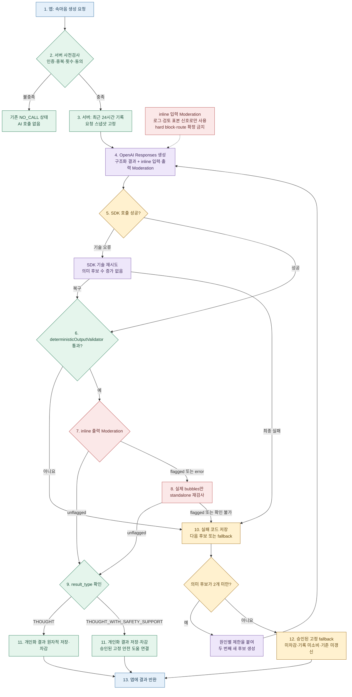

# 속마음 D안 런타임 변경 요청

## 0. 이 문서가 이번 구현의 단일 기준이다

이 문서는 현재 코드 `feature/venting-tab`의 `3a5cd9c`에서 **바꿔야 하는
런타임 차이만** 설명한다.

- 대상: 실제 앱과 `generate-venting-observation` Edge Function
- 제외: Prompt Lab, 프롬프트 본문, few-shot, 문체 평가, 운영 기본 모델 확정
- 목표: 정상 요청은 빠르게 끝내고, 잘못된 차단을 줄이며, 실패 원인을 다음 개선에
  사용할 수 있게 보존한다.
- 기존 문서와 충돌하면 이 문서가 우선한다.
- 결정적 출력 검사의 첫 구현 범위와 기존 대비 상세값은
  [속마음 결정적 출력 검사 P0 변경 요청](속마음-결정적-출력검사-P0-변경요청.md)을
  따른다.

### 10분 인계 순서

1. `1. 현재와 D안의 차이`
2. `2. 최종 처리 흐름`
3. `5. 반드시 저장할 값`
4. `7. 수용 테스트`
5. `8. HOLD`

## 1. 현재와 D안의 차이

| 항목 | 현재 `3a5cd9c` | D안 변경 |
|---|---|---|
| OpenAI 호출 | `fetch()`로 REST 직접 호출 | 공식 JavaScript SDK로 전환 |
| 기술 오류 재시도 | 페블링 생성 루프 안에서 의미 재생성과 혼재 | SDK가 담당. `maxRetries: 1`부터 시작하고 계측 후 조정 |
| 의미 생성 후보 | 최초 포함 최대 2개 | 최대 2개 유지 |
| Moderation | 후보마다 `bubbles`를 standalone `/v1/moderations`로 검사 | Responses 요청에 inline 입력·출력 Moderation을 포함 |
| 재검사 | 모든 후보에 standalone 1회 이상 | inline 출력이 `flagged` 또는 `error`일 때만 실제 `bubbles`를 standalone 재검사 |
| 입력 Moderation | 없음 | inline 결과를 저장하되, v1에서는 차단·`safety_route` 확정에 사용하지 않음 |
| 구조·제품 계약 | JSON 스키마와 코드 검사가 분산 | 하나의 `deterministicOutputValidator` 결과로 통합 |
| 코드 허용 범위 | 말풍선 3~7개, 개별 90자, 전체 420자, 질문 수 제한 | 1~20개, 빈 값 금지, 개별 300자, 전체 3,000자. 질문 수 하드 실패 제거 |
| Moderation 실패 | 바로 새 후보 생성 | 실제 `bubbles` 재검사가 통과하면 같은 후보 사용 |
| 모든 후보 실패 | `generation_failed` 계열 | 개인화 결과 대신 승인된 고정 fallback, 미차감·미소비 |
| 로그 | 요청에 누적 호출 수와 마지막 이유 중심 | 요청 단위 + 후보 시도 단위로 분리하고 각 판정 근거 저장 |
| 실패 원문 | 상시 검토 저장 계약 없음 | 일반 로그에는 저장 금지. 별도 동의 표본만 암호화해 30일, 승인 건만 최대 90일 |
| 알 수 없는 안전 우선도 | 일부 실패 경로에서 `urgent` 기본값 | `urgent`로 강제 변환 금지. 미확정 상태와 fallback 표시 방식을 분리 |

### 바꾸지 않는 계약

- `result_type`: `THOUGHT | THOUGHT_WITH_SAFETY_SUPPORT`
- `safety_route` 값:
  `self_harm | harm_to_others | abuse_or_exploitation |
  acute_medical_or_substance | helping_person_at_risk | null`
- `safety_priority`: `standard | urgent | null`
- `THOUGHT`에는 `safety_route`와 `safety_priority`가 모두 `null`
- `THOUGHT_WITH_SAFETY_SUPPORT`에는 route가 있고 priority는
  `standard | urgent`
- 안전 도움 문구와 기관·연락처는 AI가 만들지 않고 승인된 DB 값만 사용
- 성공한 경우에만 결과 저장, 횟수 차감, 입력 기록 사용 처리, 분석 기준 갱신

## 2. 최종 처리 흐름



### 순서가 이래야 하는 이유

1. 서버 사전검사를 먼저 해 무권한·중복 요청의 AI 비용을 만들지 않는다.
2. 요청 스냅샷을 먼저 고정해 재생성 중 입력이 달라지는 것을 막는다.
3. 구조화 생성과 inline Moderation을 한 Responses 요청으로 받아 정상 경로의
   왕복 호출을 줄인다.
4. JSON을 파싱하고 코드 계약을 확인해야 실제 표시 대상인 `bubbles`를 정확히
   standalone 재검사할 수 있다.
5. inline 출력이 문제없으면 별도 Moderation을 호출하지 않는다.
6. inline 출력이 의심돼도 전체 응답이 아니라 실제 표시할 `bubbles`만 다시 검사해
   사용자 원문이나 route 필드 때문에 생긴 오탐을 분리한다.
7. 같은 후보가 재검사를 통과하면 버리지 않는다.
8. 개인화 후보가 모두 실패했을 때만 고정 fallback을 쓴다.
9. 저장·차감·기록 소비는 하나의 트랜잭션으로 성공할 때만 실행한다.

## 3. 구현 요청

### 3.1 OpenAI provider를 공식 SDK로 전환

대상:

- `supabase/functions/generate-venting-observation/providers/openai.ts`
- `supabase/functions/generate-venting-observation/generation-pipeline.ts`

요청:

1. 공식 `openai` JavaScript SDK 버전을 고정한다.
2. provider adapter에서 client를 한 번 만들고 재사용한다.
3. 기술 오류 재시도는 SDK에 맡기고 `maxRetries: 1`부터 시작한다.
4. 현재 30초 timeout은 명시적인 설정으로 옮기되 실제 p95를 측정한 뒤 조정한다.
5. 앱의 의미 재생성 카운터와 SDK의 HTTP 시도 횟수를 분리한다.
6. SDK 전환 후 실제 번들·Deno Edge 배포·cold start를 확인한다.
7. OpenAI API key, 원문, 전체 응답을 콘솔이나 오류 추적 도구에 출력하지 않는다.
8. 설치한 SDK가 실제 retry 횟수를 직접 노출하지 않으면 provider transport를
   계측해 `provider_http_attempt_count`를 남긴다. 최대값을 실제 횟수처럼
   추정해 저장하지 않는다.

의미:

- SDK가 같은 요청을 기술적으로 다시 보내는 것은 **새 후보가 아니다**.
- 계약·Moderation 실패 후 새로운 결과를 만드는 것만
  `semantic_attempt_no`가 증가한다.
- SDK 기본값에 의존하지 말고 실제 사용 값을 코드와 로그에 남긴다.

### 3.2 Responses inline Moderation 추가

개념 예시:

```ts
const response = await client.responses.create({
  model,
  store: false,
  input,
  text: { format: structuredOutputFormat },
  moderation: { model: "omni-moderation-latest" },
});
```

처리:

- `response.moderation.input`과 `response.moderation.output`의 `type`을 먼저 확인한다.
- `type === "error"`면 점수가 있다고 가정하지 않는다.
- `flagged`, 전체 `categories`, `category_scores`,
  `category_applied_input_types`를 보존한다.
- 입력 결과는 v1에서 운영 분석·표본 검토 신호다.
  `flagged === true`만으로 생성 차단, route 또는 priority 확정을 하지 않는다.
- 출력 결과가 `flagged` 또는 `error`일 때만 `bubbles.join("\n")`을
  standalone `omni-moderation-latest`로 재검사한다.
- standalone 재검사가 `unflagged`면 같은 후보를 계속 사용한다.
- 여전히 `flagged`거나 결과를 확인할 수 없으면 해당 후보를 노출하지 않는다.

OpenAI 공식 문서도 inline 결과를 앱 정책의 **신호**로 사용하고 자동 차단 결정으로
취급하지 말라고 안내한다. 안전한 거절이나 도움 문구도 위해 주제를 언급해
flag될 수 있기 때문이다.

### 3.3 결정적 출력 validator 통합

하나의 `deterministicOutputValidator`가 아래를 검사하고 오류 코드를 배열로
반환한다.

| 검사 | D안 계약 |
|---|---|
| JSON·필수 필드·enum | 유지 |
| `bubbles` 개수 | 1~20 |
| 빈 말풍선 | 금지 |
| 말풍선 길이 | 각 300자 이하 |
| 전체 길이 | 3,000자 이하 |
| 질문 수 | 하드 실패에서 제거 |
| 직접 식별정보 반복 | 금지 유지 |
| `THOUGHT` 조합 | route와 priority 모두 `null` |
| `THOUGHT_WITH_SAFETY_SUPPORT` 조합 | route 필수, priority는 `standard | urgent` |
| 알 수 없는 priority | `urgent`로 보정하지 않고 계약 실패 또는 fallback 상태로 분리 |

validator는 구조와 정해진 조합을 기계적으로 확인한다. 문장의 자연스러움,
근거성, 위험 의미 해석은 이 validator에 넣지 않는다.

### 3.4 의미 재생성과 fallback

- 개인화 후보는 최초 포함 최대 2개다.
- 두 번째 후보는 첫 실패 코드를 받아 범위만 제한해 새로 생성한다.
- 첫 결과의 정상 문장을 편집하거나 문제 문자열만 치환하지 않는다.
- 예외적으로 `trim` 후 빈 말풍선 항목을 제거하는 것은 안전한 배열 정규화로
  허용한다. 정규화 뒤 1개 이상이면 같은 후보를 계속 사용한다.
- 생성 기술 오류, 계약 실패, Moderation 실패를 같은 코드로 뭉치지 않는다.
- 두 후보가 모두 실패하면 더 생성하지 않고 승인된 고정 fallback을 반환한다.
- fallback에서는 횟수를 차감하지 않고, entry를 소비하지 않고,
  분석 cursor를 갱신하지 않는다.
- fallback 최종 문구·화면·내부 enum 이름은 `8. HOLD` 확정 전 임의로 만들지 않는다.

### 3.5 `safety_priority` 처리

| 값 | 의미 | 처리 |
|---|---|---|
| `null` | 안전 도움 경로가 없는 일반 결과 | `THOUGHT`에서만 허용 |
| `standard` | 고정 안전 도움을 함께 보여주되 긴급 강조가 필요하지 않은 경우 | route에 맞는 승인 자원 표시 |
| `urgent` | 같은 안전 도움 중 더 눈에 띄게 먼저 보여야 하는 경우 | route에 맞는 승인 자원을 강하게 노출 |

주의:

- priority는 임상 진단이나 위험 확률이 아니다.
- Moderation category score로 priority를 직접 결정하지 않는다.
- 값 누락이나 파싱 실패를 `urgent`로 바꾸지 않는다.
- route·priority를 AI가 생성하는 v1 계약은 유지하되, 오프라인 회귀 세트에서
  route·priority 정확도를 별도로 검증한다.

## 4. 데이터 구조 권장

기존 `journal.venting_observation_requests` 한 행에 모든 시도 정보를 덮어쓰지 않는다.

```text
venting_observation_requests      요청 1건의 최종 상태와 공통 스냅샷
  └─ venting_observation_attempts 후보 1개당 생성·검사·비용 근거
       └─ review_sample_id?       별도 동의가 있을 때만 원문 검토 저장소 연결
```

권장:

- 기존 request 테이블은 확장한다.
- 새 `journal.venting_observation_attempts`를 만든다.
- 별도 동의 원문은 접근권한이 분리된
  `journal.venting_observation_review_samples`에 둔다.
- category가 추가돼도 마이그레이션 없이 보존하도록 Moderation 세부값은 JSONB를
  사용하되, 자주 조회할 `flagged`, `type`, `failure_code`는 별도 열로 둔다.
- 사용자 앱 role은 attempts와 review samples를 직접 조회하지 못하게 한다.

## 5. 개선을 위해 반드시 저장할 값

### 5.1 P0 — 요청 단위

기존 열은 재사용하고 없는 값만 추가한다.

| 필드 | 형식 예시 | 목적 |
|---|---|---|
| `request_id` | uuid | 모든 단계 연결 |
| `user_id` | 내부 uuid | 소유권·삭제 처리. 이메일·실명 복제 금지 |
| `idempotency_key` | uuid | 중복 실행·중복 차감 방지 |
| `requested_at`, `started_at`, `completed_at` | timestamptz | 전체 지연·장애 분석 |
| `request_timezone`, `quota_date` | text, date | 4시 기준·횟수 재현 |
| `consent_type`, `consent_version`, `consented_at` | text | OpenAI 전송 근거 재현 |
| `access_tier`, `limit_count`, `quota_before`, `quota_after` | text, int | 권한·차감 검증 |
| `target_entry_ids`, `included_entry_ids`, `excluded_entry_ids` | bigint[] | 어떤 기존 기록을 사용했는지 재현 |
| `target_entry_count`, `included_entry_count` | int | 원문 없이 입력 규모 분석 |
| `target_total_char_len`, `included_total_char_len` | int | 길이·실패 상관 분석 |
| `boundary_entry_id`, `boundary_prefix_truncated` | bigint, bool | 20,000자 절단 재현 |
| `model_id`, `prompt_version`, `policy_version` | text | 결과 재현 |
| `schema_version`, `validator_version` | text | 계약 변경 추적 |
| `moderation_model` | text | 판정 모델 추적 |
| `openai_sdk_version`, `edge_release_sha` | text | 런타임 변경 추적 |
| `semantic_attempt_count` | smallint | 후보 수 |
| `provider_http_attempt_count` | smallint | SDK 기술 시도 수 |
| `standalone_moderation_call_count` | smallint | 조건부 추가 왕복 수 |
| `final_outcome` | text | 성공·고정 fallback·NO_CALL·시스템 실패 구분 |
| `result_type`, `safety_route`, `safety_priority` | text | 최종 제품 분기 |
| `fallback_type` | text nullable | 개인화 실패 후 노출 상태 |
| `failure_stage`, `failure_code` | text | 마지막 실패 원인 |
| `observation_id` | bigint nullable | 성공 결과 연결 |
| `quota_charged` | bool | 잘못된 차감 탐지 |
| `entries_consumed` | bool | 잘못된 기록 소비 탐지 |
| `analysis_cursor_advanced` | bool | 실패 후 누락 탐지 |
| `total_latency_ms` | int | 사용자 체감 |
| `total_input_tokens`, `total_output_tokens`, `total_cached_tokens`, `total_reasoning_tokens` | int | 비용·모델 비교 |
| `pricing_version`, `estimated_cost_usd` | text, numeric | 가격 변경 시 재계산 가능 |
| `raw_review_consent` | bool | 원문 표본 저장 가능 여부 |

### 5.2 P0 — 후보 시도 단위

`journal.venting_observation_attempts` 한 행은 **의미 후보 하나**다.
SDK 내부 기술 재시도는 새 행을 만들지 않고 같은 행의 횟수로 기록한다.

| 필드 | 형식 예시 | 목적 |
|---|---|---|
| `attempt_id`, `request_id` | uuid | 요청과 후보 연결 |
| `semantic_attempt_no` | 1 또는 2 | 후보 순서 |
| `attempt_reason` | `initial`, `contract_failure`, `moderation_failure`, `provider_failure` | 왜 생성했는지 |
| `started_at`, `completed_at`, `latency_ms` | 시간·int | 후보 지연 |
| `model_id`, `prompt_version`, `policy_version`, `schema_version`, `validator_version` | text | 후보 재현 |
| `openai_response_id`, `openai_request_id` | text nullable | 제공사 추적 |
| `provider_http_attempt_count` | smallint | SDK 기술 재시도 확인 |
| `provider_status`, `provider_error_class`, `provider_error_code` | text nullable | 429·5xx·timeout 구분 |
| `response_status` | text | complete·incomplete 등 |
| `parse_status` | text | JSON 파싱 성공 여부 |
| `validator_passed` | bool | 코드 계약 결과 |
| `validator_failure_codes` | text[] | 어떤 계약이 실패했는지 |
| `bubble_count`, `maximum_bubble_char_len`, `total_bubble_char_len` | int | 길이 튜닝 |
| `pii_echo_detected` | bool | 직접 식별정보 반복 여부. 원문 저장 금지 |
| `candidate_result_type`, `candidate_safety_route`, `candidate_safety_priority` | text | 후보 분기 평가 |
| `candidate_output_hmac`, `candidate_output_hmac_key_version` | text | 원문 없이 중복 후보 탐지. 일반 hash 대신 서버 비밀키 기반 HMAC 사용 |
| `inline_input_moderation_type` | `result` 또는 `error` | inline 입력 검사 상태 |
| `inline_input_flagged` | bool nullable | 입력 신호 |
| `inline_input_categories`, `inline_input_category_scores`, `inline_input_applied_types` | jsonb | 전체 입력 판정 |
| `inline_output_moderation_type` | `result` 또는 `error` | inline 출력 검사 상태 |
| `inline_output_flagged` | bool nullable | 출력 첫 판정 |
| `inline_output_categories`, `inline_output_category_scores`, `inline_output_applied_types` | jsonb | 전체 출력 판정 |
| `standalone_recheck_performed` | bool | 추가 호출 여부 |
| `standalone_flagged` | bool nullable | 실제 bubbles 재검사 |
| `standalone_categories`, `standalone_category_scores`, `standalone_applied_types` | jsonb | bubbles 판정 |
| `moderation_error_code` | text nullable | 판정 실패 원인 |
| `input_tokens`, `output_tokens`, `cached_tokens`, `reasoning_tokens` | int | 후보 비용 |
| `estimated_cost_usd` | numeric | 후보 비용 |
| `disposition` | `accepted`, `discarded_contract`, `discarded_moderation`, `provider_failed`, `superseded` | 최종 사용 여부 |
| `failure_stage`, `failure_code` | text nullable | 후보 실패 원인 |
| `review_sample_id` | uuid nullable | 동의 기반 원문 표본 연결 |

### 5.3 실패 코드 표준

문자열 메시지 대신 아래 코드로 집계한다. 상세 메시지는 민감한 원문을 포함하지
않는 범위에서만 보조 저장한다.

| 단계 | 코드 |
|---|---|
| provider | `provider_timeout`, `provider_network`, `provider_rate_limited`, `provider_5xx`, `provider_auth`, `response_incomplete` |
| parse·contract | `json_parse_failed`, `schema_invalid`, `bubble_count_invalid`, `bubble_empty`, `bubble_too_long`, `total_too_long`, `pii_echo`, `result_safety_combination_invalid` |
| moderation | `inline_output_flagged`, `inline_output_error`, `standalone_bubbles_flagged`, `standalone_moderation_error` |
| storage | `finalize_failed`, `evidence_write_failed` |
| recovery | `semantic_attempts_exhausted`, `fixed_fallback_returned`, `fallback_return_failed` |

### 5.4 별도 동의 원문 표본

다음 값은 일반 request·attempt 로그, Sentry/Firebase, 분석 도구, 스프레드시트에
저장하지 않는다.

- 사용자 기록 원문
- 실패한 후보의 `bubbles` 원문
- 전화번호·주소·실명 등 직접 식별정보
- 전체 OpenAI 요청·응답 body

개선을 위해 실제 문장을 사람이 확인해야 할 때만 별도 동의를 받고 다음 저장소를
사용한다.

| 필드 | 목적 |
|---|---|
| `review_sample_id`, `request_id`, `attempt_id` | 메타데이터 연결 |
| `consent_type`, `consent_version`, `consented_at`, `consent_source` | 검토 권한 근거 |
| `encrypted_input_snapshot` | 당시 입력. 앱 DB 수준과 별도 접근통제 |
| `encrypted_candidate_output` | 폐기 후보 원문 |
| `sample_reason_codes` | 왜 검토 표본이 됐는지 |
| `accessed_by`, `accessed_at`, `access_purpose` | 열람 감사 로그 |
| `created_at`, `delete_at`, `deleted_at` | 자동 삭제 증거 |
| `retention_extension_approved_by`, `retention_extension_reason` | 90일 연장 승인 |

보관:

- 기본 30일 후 자동 삭제
- 승인된 조사 건만 최대 90일
- 장기 회귀 세트에는 원문을 그대로 옮기지 않는다.
- 비식별·합성 사례로 전환한 뒤 원문과 연결을 끊는다.
- 동의 철회·회원 탈퇴 시 법적 보존 의무가 없는 표본은 삭제 대상으로 처리한다.

### 5.5 P1 — 운영 대시보드용 집계

원문 없이 아래를 집계한다.

- 생성 성공률, 고정 fallback률, 의미 2차 생성률
- SDK 기술 재시도율과 오류 코드 분포
- inline 출력 flag율
- inline flag 후 standalone 통과율: 오탐 후보를 보여주는 핵심 값
- standalone 최종 flag 카테고리 분포
- 계약 오류 코드 분포
- `safety_route`·`safety_priority` 분포
- 모델·프롬프트 버전별 p50/p95 지연
- 요청당 평균 token·비용
- 차감·entry 소비·cursor 갱신 불일치 0건
- 동의 표본의 사람 판정: false positive, false negative, route 오류,
  priority 오류, 문체 오류

## 6. DB·보안 수용 조건

- request 최종 성공, observation 생성, quota 차감, entry 소비,
  cursor 갱신은 하나의 원자적 finalize에서 처리한다.
- 고정 fallback에서는 위 네 가지가 모두 실행되지 않는다.
- attempt 쓰기 실패가 사용자 요청을 무한 재실행시키지 않도록 오류 정책을 명시한다.
- 운영 로그와 오류 추적 도구에는 원문을 보내지 않는다.
- attempts와 review samples는 service role 전용으로 제한한다.
- 검토 표본 열람은 감사 로그를 남긴다.
- `delete_at` 기반 자동 삭제 작업과 삭제 실패 알림을 만든다.
- API key와 내부 프롬프트 원문은 DB 로그 필드에 저장하지 않는다.

## 7. 수용 테스트

### 7.1 필수 자동 테스트

- [ ] 첫 후보가 계약·inline 출력 Moderation을 통과하면 Responses 1회,
      standalone Moderation 0회로 성공한다.
- [ ] SDK 기술 재시도가 일어나도 `semantic_attempt_no`는 증가하지 않는다.
- [ ] inline 출력이 flagged지만 `bubbles` standalone이 unflagged면
      같은 후보가 저장된다.
- [ ] inline 출력이 error여도 `bubbles` standalone이 unflagged면
      같은 후보가 저장된다.
- [ ] standalone이 flagged면 첫 후보를 버리고 두 번째 새 후보를 만든다.
- [ ] 후보 2개가 모두 실패하면 고정 fallback을 반환한다.
- [ ] fallback은 quota 미차감, entry 미소비, cursor 미갱신이다.
- [ ] `THOUGHT`에 route 또는 priority가 있으면 계약 실패한다.
- [ ] `THOUGHT_WITH_SAFETY_SUPPORT`에 route가 없거나 priority가
      `standard | urgent`가 아니면 계약 실패한다.
- [ ] priority 누락을 `urgent`로 자동 변환하지 않는다.
- [ ] 말풍선 1개와 20개는 통과하고 0개와 21개는 실패한다.
- [ ] 300자 말풍선과 총 3,000자는 통과하고 초과값은 실패한다.
- [ ] 질문 개수만으로 계약 실패하지 않는다.
- [ ] 같은 `idempotency_key` 재요청은 중복 생성·중복 차감하지 않는다.
- [ ] 성공 finalize 중 DB 오류가 나면 부분 차감·부분 소비가 남지 않는다.
- [ ] 모든 시도의 실패 코드·Moderation 값·token 사용량이 서로 덮어쓰이지 않는다.
- [ ] 동의가 없으면 review sample 원문이 생성되지 않는다.
- [ ] 일반 로그·Sentry/Firebase에 입력·폐기 후보 원문이 없다.
- [ ] 30일 삭제와 승인된 90일 연장 작업을 시간 이동 테스트로 검증한다.

### 7.2 개발자 완료 증거

개발 완료 회신에 다음을 포함한다.

1. 변경 파일 목록과 migration 파일
2. 설치한 OpenAI SDK 정확한 버전
3. `maxRetries`, timeout의 실제 설정값
4. SDK에서 실제 확인한 inline Moderation 응답 shape fixture
5. 각 필수 테스트의 실행 결과
6. DB 예시 행: request 1개와 attempts 1~2개
7. 원문이 일반 로그에 남지 않는다는 확인
8. 성공·재검사 통과·두 번째 후보 성공·fallback의 4개 실행 trace
9. rollback 방법과 feature flag

## 8. HOLD — 개발자가 임의로 확정하지 않는다

| 항목 | 현재 처리 |
|---|---|
| 운영 프롬프트 본문·few-shot·문체 규칙 | 프롬프트 재설계 후 별도 전달 |
| 2차 생성의 최종 문구 | 코드에는 실패 코드 주입 자리만 만들고 실제 문구는 별도 전달 |
| 운영 기본 생성 모델 | 설정 교체 가능하게 유지. 모델명 임의 확정 금지 |
| fallback 최종 카피·화면·내부 enum 이름 | 제품 확정 전 임시 문구를 배포하지 않음 |
| route별 `standard`·`urgent` 세부 판정 규칙 | 현행 계약 유지, 회귀 검증 후 별도 보강 |
| 운영 메타데이터의 최종 보관 기간 | `delete_at` 구조를 만들고 개인정보 정책과 함께 값 확정 |
| Prompt Lab 동일 흐름 구현 | 이 문서 범위 밖. 별도 변경요청서에서 처리 |
| PPT 갱신 | 하지 않음 |

## 9. 근거와 참고

- 현재 코드:
  - `supabase/functions/generate-venting-observation/providers/openai.ts`
  - `supabase/functions/generate-venting-observation/generation-pipeline.ts`
  - `supabase/functions/generate-venting-observation/contract.ts`
  - `supabase/functions/generate-venting-observation/index.ts`
  - `supabase/migrations/20260728102414_add_observation_v050_runtime_contract.sql`
- 제품 설계 근거:
  [속마음 런타임 시스템 지도](../../../30_app/planning/paid-products/11-inner-thought-runtime-system-map.md)
- [OpenAI Moderation — generated content](https://developers.openai.com/api/docs/guides/moderation#moderate-generated-content)
- [OpenAI Responses create](https://developers.openai.com/api/reference/resources/responses/methods/create)
- [OpenAI 공식 SDK](https://developers.openai.com/api/docs/libraries#install-an-official-sdk)

OpenAI 문서 확인 기준일: 2026-07-31.
