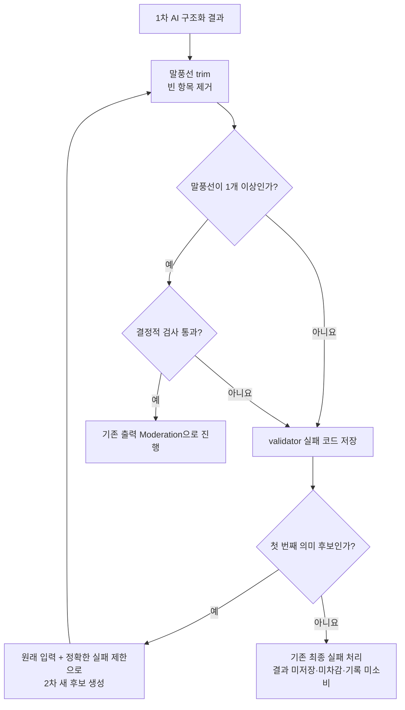

# 속마음 결정적 출력 검사 P0 변경 요청

> **SUPERSEDED — 구현 기준으로 사용하지 않음**
>
> 이 문서의 `1~20개 / 300자 / 3,000자`, 재생성, DB 제약과 수용 테스트는
> [속마음 출력 계약·inline Moderation·실패 결과 저장 변경 요청](../../속마음-출력계약-Moderation-저장-변경요청.md)이
> 대체한다. 최신 문서는 실제 앱 런타임만 다루며 Prompt Lab은 제품 책임자가 별도
> 관리한다. 이 문서는 2026-07-31 당시 논의 근거로만 보존한다.

## 1. 목적과 범위

빈 말풍선처럼 서버가 안전하게 정리할 수 있는 오류 때문에 AI를 다시 호출하지
않고, 실제 재생성이 필요한 경우에는 정확한 실패 원인만 전달한다.

- 이번 구현: 출력 정규화, 결정적 검사, 1회 재생성, 실패 코드 저장, DB 제약 정합화
- 제외: Prompt Lab, 프롬프트 본문 재설계, Moderation 구조, OpenAI SDK 전환,
  3차 생성, 고정 fallback 최종 정책
- 상위 런타임 기준:
  [속마음 D안 런타임 변경 요청](속마음-D안-런타임-변경요청.md)
- 이 문서는 D안 중 **결정적 출력 검사 P0의 상세 구현 기준**이다.

## 2. 기존 → 변경

| 항목 | 기존 `3a5cd9c` | 변경 |
|---|---|---|
| 빈 말풍선 | 전체 후보 폐기 후 AI 재생성 | `trim` 후 빈 항목 제거. 1개 이상 남으면 같은 후보 계속 사용 |
| 말풍선 수 | 3~7개 | 1~20개 |
| 개별 길이 | 90자 이하 | 300자 이하 |
| 전체 길이 | 420자 이하 | 3,000자 이하 |
| 질문 수 | 일반 최대 1개, 안전 결과 0개 | 하드 실패 검사 제거 |
| 안전 상태 조합 | 유지 | 동일하게 유지 |
| 직접 식별정보 반복 | 유지 | 동일하게 유지 |
| 실패 구분 | 오류 문구에 특정 영어 단어가 있는지로 분류 | 고정 오류 코드로 분류 |
| 2차 생성 지시 | `contract_violation` 등 일반 지시 | 실제 실패 코드에 해당하는 제한만 전달 |
| 자동 의미 생성 | 최대 2회 | 최대 2회 유지 |
| 최종 실패 저장 | `generation_failed` 같은 큰 분류만 저장 | 기존 큰 분류 + 마지막 validator 실패 코드 저장 |
| DB 제약 | 말풍선 3~7개 | 말풍선 1~20개. 서버와 같은 배포에서 변경 |
| 실패 시 차감 | 미차감·기록 미소비 | 유지 |

## 3. 변경 후 처리 흐름



중요:

- 빈 항목 제거는 문장 내용을 고치는 작업이 아니라 출력 배열 정규화다.
- 정상 문장을 자르거나, 위험 표현을 치환하거나, 안전 상태를 임의 보정하지 않는다.
- 2차 생성도 실패하면 이번 P0에서는 기존 오류 화면을 유지한다.

## 4. 구현 요청

### 4.1 말풍선 정규화

대상:

- `supabase/functions/generate-venting-observation/contract.ts`

처리 순서:

```ts
const normalizedBubbles = bubbles
  .map((bubble) => bubble.trim())
  .filter((bubble) => bubble.length > 0);
```

- 정규화 후 1개 이상이면 validator로 전달한다.
- 모두 제거되면 `BUBBLE_COUNT_INVALID`로 실패시킨다.
- 제거 전후 개수는 테스트에서 확인하되 사용자 원문·후보 원문을 로그에 남기지 않는다.

### 4.2 결정적 검사 계약

하나의 validator 결과가 아래 형식을 반환하도록 한다.

```ts
type ValidatorResult = {
  valid: boolean;
  codes: ValidatorFailureCode[];
  metrics: {
    bubbleCount: number;
    maximumBubbleCharacters: number;
    totalCharacters: number;
    piiEchoDetected: boolean;
  };
};
```

검사 기준:

| 검사 | 기준 |
|---|---|
| JSON·필수 필드·enum | 유지 |
| 말풍선 수 | 1~20 |
| 빈 말풍선 | 정규화 후 남아 있으면 실패 |
| 개별 길이 | 각 300자 이하 |
| 전체 길이 | 합계 3,000자 이하 |
| 질문 수 | 검사하지 않음 |
| 직접 식별정보 반복 | 기존 검사 유지 |
| `THOUGHT` | `safety_route`, `safety_priority` 모두 `null` |
| `THOUGHT_WITH_SAFETY_SUPPORT` | route 필수, priority는 `standard` 또는 `urgent` |

validator는 문체, 공감, 자연스러움, 위험 의미를 평가하지 않는다.

### 4.3 실패 코드

문자열 메시지 검색으로 분류하지 말고 아래 고정 코드를 사용한다.

```text
JSON_PARSE_FAILED
INVALID_FIELD_TYPE
BUBBLE_COUNT_INVALID
BUBBLE_TOO_LONG
TOTAL_LENGTH_EXCEEDED
INVALID_SAFETY_COMBINATION
PII_ECHO_DETECTED
```

- `ObservationContractError`가 `codes`를 보유하도록 한다.
- 사용자 응답에는 내부 코드를 노출하지 않는다.
- 기존 `failure_code`는 앱 replay 호환을 위해
  `generation_failed` 계열의 최종 상태값으로 유지한다.
- 요청 행에는 `last_validator_failure_codes text[]`를 추가해 마지막 실패 원인을
  별도로 저장한다.

### 4.4 2차 생성

- 최초 포함 최대 2개 후보를 유지한다.
- 1차 실패 시 원래 사용자 입력과 같은 요청 스냅샷을 사용한다.
- 직전 후보 원문은 2차 생성에 다시 넣지 않는다.
- 일반적인 “더 엄격히 지켜라” 대신 실패 코드에 해당하는 지시만 추가한다.

예:

| 실패 코드 | 2차 생성에 추가할 제한 |
|---|---|
| `BUBBLE_COUNT_INVALID` | 말풍선 배열을 1~20개로 반환 |
| `BUBBLE_TOO_LONG` | 각 말풍선을 300자 이하로 반환 |
| `TOTAL_LENGTH_EXCEEDED` | 전체 말풍선 합계를 3,000자 이하로 반환 |
| `INVALID_SAFETY_COMBINATION` | 결과 유형에 맞는 route·priority 조합만 반환 |
| `PII_ECHO_DETECTED` | 입력의 전화번호·주소·이메일 등 직접 식별정보를 반복하지 않음 |

여러 코드가 있으면 해당 제한을 함께 전달한다. 원문이나 실패 후보 문장은 넣지 않는다.

### 4.5 DB migration

기존 migration 파일을 수정하지 말고 새 migration으로 반영한다.

필수:

1. `venting_observations`의 말풍선 배열 제약을 1~20개로 변경
2. ready 상태 제약도 1~20개로 변경
3. `finalize_venting_observation_v040` 내부 3~7개 검사를 1~20개로 교체
4. 안전 결과의 `safety_priority = null`을 허용하는 테이블 제약 제거
5. `last_validator_failure_codes text[]` 추가

배포 순서:

1. DB migration
2. Edge Function
3. 앱

DB를 먼저 넓히면 기존 3~7개 결과도 계속 유효하다. Edge Function을 먼저
배포하면 1~2개 또는 8~20개 결과가 서버를 통과한 뒤 DB에서 실패할 수 있다.

## 5. 최종 실패 시 유지할 동작

2차 후보도 실패하면:

- observation 생성하지 않음
- 이용 횟수 차감하지 않음
- 입력 entry를 사용 처리하지 않음
- request는 `failed`로 종료
- 일반 실패는 기존 `generation_failed`, `retryAllowed: true` 유지
- 앱은 기존 오류 bottom sheet를 표시
- 사용자가 다시 시도하면 새 `requestId`로 처음부터 실행

안전 실패 화면과 고정 fallback 정책은 이번 P0에서 변경하지 않는다.

## 6. 수용 테스트

다음 테스트를 코드 실행 방식으로 추가한다.

- 말풍선 1개·20개 통과
- 말풍선 0개·21개 실패
- `["문장", "  "]`이 `["문장"]`으로 정규화되어 재생성 없이 통과
- 모든 말풍선이 빈 값이면 실패
- 개별 300자 통과, 301자 실패
- 전체 3,000자 통과, 3,001자 실패
- 질문이 여러 개여도 질문 수 때문에 실패하지 않음
- 허용·비허용 result/route/priority 조합 전체
- 직접 식별정보 반복 실패
- 1차 실패 코드가 2차 생성 지시로 전달됨
- 2차 성공 시 1회만 저장·차감
- 2차도 실패하면 observation·차감·entry 소비 없음
- DB가 1개·20개를 허용하고 0개·21개를 거부
- 기존 속마음 테스트 전체 회귀 통과

## 7. 완료 회신

개발자는 다음만 회신한다.

1. 변경 파일과 migration 이름
2. 오류 코드 목록
3. 자동 테스트 결과
4. 1차 실패 → 2차 성공 로그 1건
5. 2차 최종 실패 → 미저장·미차감 확인 1건
6. 남은 미확정 사항
