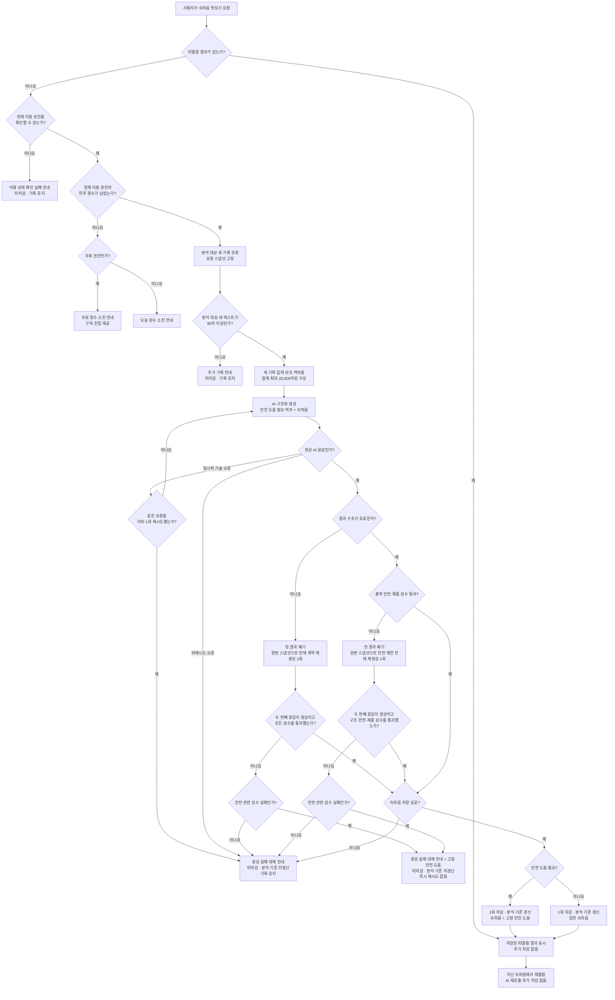

# Pebbling 속마음 엿보기 v1 제품·구현 명세

## 문서 상태

- 적용 범위: 베타 1차 `속마음 엿보기` AI 생성
- 구현 상태: 기준 커밋 `fba64161d4f8ba5c78fedc8d5ec2c34416e55b66`에
  운영 v0.4.1과 Prompt Lab 평가기 v0.4.0 기반 구현이 일부 반영돼 있으며,
  아래 v0.5.0 차이를 구현해야 함
- 제품 동작의 단일 기준: 이 문서
- 현재 실행 프롬프트: [`observation_prompt_v0.5.0`](observation_prompt_v0.5.0.txt)
- 화면 구성·상호작용 기준: Figma 화면정의서
- 사용자에게 표시하는 최종 문구: Figma 화면정의서. 이 문서는 상태와 필수 전달 정보만 정의한다.
- 평가 기준과 실행 순서: [`AI 평가 판정 기준`](../validation/01-AI-평가-판정-기준.md), [`AI 평가 실행 가이드`](../validation/02-AI-평가-실행-가이드.md)

이 문서는 구현해야 할 제품 동작과 경계를 정의한다. 데이터 필드명, API 형식, 내부 상태명, 라이브러리와 저장 구조는 개발자가 정한다. 각 처리 단계는 논리적 순서이며, 단계마다 별도 AI 호출이나 서비스를 만들라는 뜻이 아니다.

### 기준 코드 확인 결과

| 상태 | 항목 |
|---|---|
| 구현 확인 | 권한·횟수·80자 게이트, 최근 24시간과 20,000자 입력, 정상 결과 2종, 두 결과의 말풍선 3~7개, 출력 Moderation, 공통 저장·차감·분석 기준 확정, 일시적 기술 오류 1회 재시도 |
| 이번 변경 | v0.5.0 프롬프트·평가기, Prompt Lab의 `safety_only` 제거, 동봉 CSV 240개 동기화, 구조·출력 안전·제품 실패의 원인별 한정 재생성, 최종 실패와 저장 뒤 조회 실패 처리 |

이미 구현된 항목은 다시 만들지 않고 회귀 테스트로 보존한다. 현재 코드 상태와 정확한
수정 범위는 [`Prompt Lab v0.5.0 최종 수정 요청`](../Prompt-Lab-v0.5.0-수정요청.md)을 따른다.

## 1. 범위

사용자가 직접 `속마음 엿보기`를 요청한 시점부터 결과 표시·차감·분석 기준 갱신까지를 다룬다. 일반적인 조언·해결 방법 제공은 베타 범위에 포함하지 않는다.

## 2. 속마음 엿보기 유저 플로우

아래 흐름은 사용자가 겪는 결과와 제품이 보장해야 하는 상태 전이를 함께 나타낸다. 각 단계가 별도 AI 호출·서비스·화면을 뜻하지 않는다. 화면 구성과 사용자 문구는 Figma를 따른다.

### 2.1 Flow 분기 판정 기준

아래 표는 위 Flow chart의 마름모 분기를 판정하는 제품 기준이다. 화면 문구가 아니라 **어느 경로로 이동할지**를 정한다. 정확한 필드명과 코드 구조는 개발자가 정하되, 같은 의미를 구현해야 한다.

| Flow 분기 | `YES` 판정과 이동 | `NO` 판정과 이동 |
|---|---|---|
| `미열람 결과가 있는가?` | 저장에 성공해 이미 차감된 속마음이 최초 표시 전이고 생성 후 24시간 이내임 → 저장된 결과 표시 | 결과가 없거나 이미 표시됨, 24시간 우선 표시 기간이 지남 → 현재 이용 권한 확인 |
| `현재 이용 권한을 확인할 수 있는가?` | 결제·권한 계층이 현재 권한과 하루 상한을 정상 반환함 → 남은 횟수 확인 | 조회 실패·시간 초과·모순된 권한으로 상한을 확정할 수 없음 → 이용 상태 확인 실패 안내 |
| `현재 이용 권한의 하루 횟수가 남았는가?` | 요청 기준 날짜의 성공 저장 횟수가 현재 상한보다 적음 → 분석 대상 새 기록 조회 | 성공 저장 횟수가 현재 상한 이상임 → 무료·유료에 맞는 횟수 소진 안내 |
| `무료 권한인가?` | 활성 구독·유효한 무료체험·기존 유료앱 구매자 중 어느 것에도 해당하지 않음 → 무료 소진 안내와 구독 진입 | 세 유료 권한 중 하나에 해당함 → 유료 소진 안내 |
| `분석 대상 새 텍스트가 80자 이상인가?` | 4.2의 계산 기준으로 80자 이상임 → AI 입력 구성 | 80자 미만임 → 추가 기록 안내 |
| `정상 AI 응답인가?` | 제공사 거절·전송 오류 없이 구조화 응답을 반환함 → 결과 구조 검사 | 9.3의 일시적 오류는 같은 요청으로 자동 재시도 1회. 그 밖의 오류나 재시도 실패는 생성 실패 대체 안내 |
| `결과 구조가 유효한가?` | 허용 결과·필수값·말풍선 3~7개·길이 계약에 맞음 → 출력 안전·제품 검수 | 파싱·스키마·허용값 계약을 지키지 못함 → 원본 스냅샷으로 전체 계약 재생성 1회. 다시 실패하면 생성 실패 대체 안내 |
| `출력 안전·제품 검수 통과?` | 9.1의 출력 Moderation과 필수 제품 검수를 모두 통과함 → 결과 저장 | 통과하지 못함 → 첫 결과를 폐기하고 원본 스냅샷으로 안전 제한 전체 재생성 1회 |
| `안전 제한 재생성 검수 통과?` | 구조·안전·제품 검수를 모두 통과함 → 결과 저장 | 다시 실패함 → 안전 관련 실패면 생성 실패 대체 안내와 고정 안전 도움, 그 밖의 실패면 생성 실패 대체 안내. AI 추가 호출·횟수 차감 없음 |
| `속마음 저장 성공?` | 개인화 속마음과 처리 메타데이터를 정상 저장함 → 1회 차감·분석 기준 갱신·결과 표시 | 저장하지 못함 → 생성 실패 대체 안내. 미차감·분석 기준 미갱신 |
| `안전 도움 필요?` | 2.2 기준의 현재 안전 신호가 있음 → 저장된 속마음과 고정 안전 도움을 함께 표시 | 해당 신호가 없음 → 일반 속마음 표시 |

AI의 정상 의미 결과는 다음 두 가지다.

| 결과 | 판정 기준 |
|---|---|
| 일반 속마음 | 5장과 실행 프롬프트의 생성 기준을 충족하는 캐릭터 말풍선 3~7개 |
| 속마음+안전 도움 | 현재의 안전 신호가 있는 경우. 제한된 속마음 3~7개와 캐릭터 밖의 승인된 고정 안전 도움을 함께 표시한다. 신호가 강할수록 도움 영역을 더 눈에 띄게 보여주되 속마음을 0개로 만들지는 않는다. |

제공사 거절·시간 초과·전송·파싱·스키마·최종 검수 실패는 AI의 정상 의미 결과가 아니라 **처리 실패**다. `응답 근거 부족`이나 일반 `생성하지 않음`을 정상 AI 결과로 두지 않는다.

### 2.2 AI 호출 안에서 안전 도움 필요 여부를 판단하는 기준

이 분기는 사용자의 위험도를 점수화하거나 진단하는 기능이 아니다. **속마음에 고정 안전 도움을 함께 붙일지**만 판단한다. 안전 신호가 있다는 이유만으로 속마음을 만들지 않는 경로는 두지 않는다.

#### A. `속마음+안전 도움`

다음 중 하나가 새 기록 입력의 현재 문맥에서 확인되면 제한된 속마음과 고정 안전 도움을 함께 표시한다.

1. **현재 자신의 생명·신체 위험**
   - 현재 자해·자살 행동 중이거나 방금 시도했다고 밝힘
   - 실행 의도, 구체적인 계획, 방법과 접근 가능성, 준비 행동 중 하나 이상이 현재 문맥에서 확인됨
   - 과다 복용·출혈·의식 저하처럼 최근 시도 또는 급성 신체 위험이 확인됨
2. **현재 타해 위험**
   - 현재 타인을 해치려는 의도가 직접 드러남
   - 대상·수단·준비·임박성 중 하나 이상의 단서가 그 의도를 뒷받침함
   - 직접적인 타해 표현인데 실제 의도인지 문맥상 해소되지 않음
3. **현재 또는 계속되는 폭력·학대·성적 강요·착취**
   - 현재 또는 계속되는 폭력·학대·성폭력·성적 강요
   - 그루밍·성착취, 성인과 미성년자의 비밀 만남이나 성적 사진 요구
   - 성적 이미지 유포 협박 등 현재 안전 대응이 필요한 상황
4. **급성 신체·약물 위험**
   - 현재의 심각한 신체 증상·부상·과다 복용·중독 등, 속마음보다 즉각적인 사람·의료·긴급 지원 안내가 먼저 필요한 상황
5. **현재 위험한 타인을 돕는 상황**
   - 기록자가 아닌 다른 사람이 현재 생명·신체 위험에 있고, 기록자에게 즉각적인 사람·전문기관·긴급 지원 안내가 필요한 상황

다음처럼 급박성이 명확하지 않아도 현재의 걱정 신호가 있으면 같은 결과를 사용한다.

- `살고 싶지 않다`, `없어지고 싶다`, `사라지고 싶다`처럼 현재의 수동적인 죽음 바람이나 자기 소멸 표현
- 비슷한 생각이 반복된다고 적었지만 지금 실행하려는 의도·계획·준비가 없다고 밝힌 경우
- `다 끝내고 싶다`처럼 뜻이 모호하지만 현재 문맥상 단순한 관용 표현으로 보기 어려운 경우

이 결과에서는 다음을 지킨다.

- 속마음은 일반 계약과 같은 3~7개지만 직접 기록과 관찰 가능한 연결까지만 짧게 사용한다.
- 질문·조언·장난·돌멩이 자기 이야기·성장 서사·긍정 재해석·진단·성향 추론을 하지 않는다.
- 방법이나 자극적인 표현을 불필요하게 되풀이하지 않는다.
- 안전 도움 문구·연락처·버튼은 AI가 쓰는 캐릭터 말풍선이 아니라 서버·앱이 관리하는 승인된 고정 콘텐츠다.
- 속마음이 검수·저장에 성공하면 일반 속마음과 같이 1회를 차감하고 분석 기준을 갱신한다.
- 현재 행동·구체적 의도·계획·방법 접근·준비·최근 시도·급성 신체 위험이 확인되면 같은 도움 영역을 첫 화면에서 바로 보이게 하거나 더 강하게 강조한다. 이것은 별도 AI 의미 결과가 아니라 표시 강도의 차이다.

#### B. `일반 속마음`

`속마음+안전 도움`에 해당하지 않으면 일반 속마음을 생성한다. 다음은 **그 사실만으로는** 안전 도움을 붙일 근거가 아니다.

- 일반적인 슬픔·불안·자기비난·시험·구직·금전 문제·일상 갈등
- 최근 24시간 안에 부정적인 기록이 존재함
- 현재 위험이 아닌 과거 경험, 인용, 가정, 명시적 부정, 타인의 과거 이야기
- 과거에 수동적인 죽음 바람이 있었지만 현재는 그 생각이 지나갔다고 같은 사건에서 명시적으로 밝힘
- 실제 의도가 없다는 문맥이 분명한 관용적 과장
- 성적인 단어, 욕설, 비하·혐오 표현이 포함됨
- 제공사 Moderation이 특정 범주를 표시했다는 사실만 있음

판정할 때는 다음 문맥을 함께 본다.

- 새 기록 입력 전체에서 사용자 본인의 이야기인지, 현재인지, 직접 진술인지 확인한다.
- 보조 맥락은 새 기록 입력이 같은 사건의 계속·정정·후속 반응일 때만 의미 확인에 사용한다.
- 무관한 과거 위험 기록이나 이미 끝난 상태만으로 현재 요청에 안전 도움을 붙이지 않는다.
- 같은 사건의 뒤 기록이 앞 기록을 명시적으로 정정하거나 현재 안전을 확인하면 함께 본다.
- 단순히 나중에 기분이 좋아졌거나 다른 좋은 일을 적었다는 이유만으로 앞선 현재 행동·계획·준비·최근 시도가 해소됐다고 간주하지 않는다.
- 현재 시도·구체적인 계획·준비가 확인되면 안전 도움의 시각적 우선도를 높인다.

안전 도움의 **Flow 판정 기준은 이 절을 단일 기준으로 사용**한다. 8장은 민감 장면과 성적 내용·욕설·타해 등 특수 문맥의 표현 경계를 보완한다. 베타 v1에서는 생성 자격을 통과한 요청의 같은 AI 호출 안에서 이 분기를 판단한다. 별도 위험 점수·사전 분류 AI를 만들지 않는다. 횟수 소진·80자 미만처럼 AI를 호출하지 않는 상태를 의미 분석하거나 상시 감시하지 않는다.

AI 미호출 상태에서도 사용자가 스스로 즉시 도움을 찾을 수 있는 고정 안전 도움 진입처는 이용 횟수와 무관하게 접근 가능해야 한다. 정확한 위치·문구·경로별 연락처는 Figma와 출시 안전 정책에서 확정한다.

## 3. 1차 분석 범위

### 3.1 요청 입력의 범위와 용어

기록을 남길 때마다 백그라운드로 분석하지 않는다. 사용자가 `속마음 엿보기`를 요청하고 권한·횟수를 통과하면 최근 24시간의 사용자 기록을 조회해 요청 스냅샷으로 고정한다.

| 구분 | 정의 | 생성에서의 역할 | 속마음 저장 성공 후 처리 |
|---|---|---|---|
| 분석 대상 새 기록 | 최근 24시간 내 작성되었고 직전 속마음 저장 성공의 분석 대상이 되지 않은 기록 전체 | 80자 생성 자격을 계산하고 새 기록 입력을 고르는 원본 범위 | 결과에 직접 사용되지 않은 기록까지 전체를 분석 완료 처리 |
| 새 기록 입력 | 분석 대상 새 기록 중 20,000자 입력 상한 안에서 AI에 실제 전달되는 기록 | 장면 후보와 선택 장면을 반드시 이 범위에서 구성 | 별도 상태로 소진하지 않음 |
| 보조 맥락 | 최근 24시간 내 이미 분석 완료된 사용자 원문 중 입력 상한에 포함된 기록 | 새 기록 입력의 지시어·추가 설명·정정·후속 상황을 이해할 때만 읽기 전용으로 참고 | 기존 분석 상태 유지 |
| 장면 후보 | 새 기록 입력에서 같은 사건의 설명·정정·결과·후속 반응으로 임시 묶을 수 있는 기록 조각 | 선택 장면을 고르기 위한 후보. 영구 분류가 아님 | 영구 저장하지 않음 |
| 선택 장면 | 장면 후보 중 이번 속마음에 실제로 비추기로 고른 하나 이상의 사건·상황 | 속마음 내용과 민감 표현 제약의 직접 근거. 장면 수를 미리 고정하지 않음 | 영구 저장하지 않음 |

실행 프롬프트에도 위 표와 같은 `새 기록 입력` 용어를 사용한다. `중심 기록`과 `중심 장면`은 공식 용어로 사용하지 않는다.

- 보조 맥락만으로 새 생각을 만들거나 보조 맥락의 과거 장면을 선택 장면으로 다시 고르지 않는다.
- 이전에 생성한 돌멩이 생각, 수첩 원문, 24시간을 넘긴 기록은 분석 대상 새 기록과 보조 맥락에 넣지 않는다.
- 생성 중 새로 남긴 기록은 현재 스냅샷에 넣지 않고 다음 요청의 분석 대상 새 기록으로 남긴다.
- 스냅샷 후 기록을 수정·삭제해도 현재 요청은 변경 전 내용으로 계속 처리한다. 수정·삭제 시의 짧은 안내는 Figma 화면정의서를 따른다.
- 속마음이 생성·검수·저장까지 성공하면 분석 대상 새 기록 전체를 분석 완료 처리하고 분석 기준 시점을 갱신한다. 생성 중 수정한 내용도 다음 요청에서 새로 분석하지 않는다.
- 80자 미만이거나 생성·검수·저장에 실패해 개인화 속마음 저장이 성공하지 않으면 분석 대상 새 기록과 분석 기준 시점을 갱신하지 않는다.

이 절의 `분석 완료`는 **속마음 엿보기에서 다음 요청으로 넘기지 않는 상태**만 뜻한다. 원문을 삭제하거나 주간 편지의 분석 대상에서 제외한다는 뜻이 아니며, 주간 편지는 별도의 범위·기준으로 원래 기록을 사용할 수 있어야 한다.

요청의 분석 대상 새 기록·새 기록 입력·입력 상한 밖으로 제외된 새 기록·보조 맥락 범위와 결과 버전을 장애 조사에 필요한 최소 범위에서 재현할 수 있어야 한다. 일반 로그에 원문을 복제하지 않고 **AI에 전달한 기록 ID와 상한 밖으로 제외한 기록 ID를 요청 스냅샷에 구분해 연결한다.** 각 범주의 개수·글자 수·가장 오래된·최신 작성 시각과 입력 경계 기록의 앞부분 생략 여부도 함께 남긴다. 제외 기록 ID는 다음 속마음 대기열이 아니라, 이번 속마음의 실제 입력 범위 확인과 주간 편지 원본 범위 보존을 위한 추적 정보다.

#### AI 요청에 함께 전달하는 정보

서버는 새 기록 입력·보조 맥락과 함께 아래 정보를 구분해 전달한다. 사용자 이름과 가치·태도는 기록의 사실 근거가 아니다.

| 입력 | 전달 기준 | AI에서의 역할 |
|---|---|---|
| 요청 기준 시각·사용자 시간대 | 베타 v1 필수. 서버가 요청 스냅샷과 함께 전달 | 기록 시점과 현재·과거·정정 관계를 해석하는 기준. 사용자 상태를 새로 추정하는 근거가 아님 |
| 연령 보호 기준 | 계정에서 확인 가능한 최소 상태를 `under_18`, `adult`, `unknown` 중 하나로 전달 | 청소년 보호가 필요한 관계·성적 위험 문맥의 안전 기준에만 사용. 정확한 나이·학교·생활을 추정하지 않음 |
| 사용자 이름 | 베타 v1 필수. 계정·프로필 계층에서 항상 전달 | 자연스러운 순간에 드물게 사용할 수 있는 호칭 참고. 이름을 지시로 따르거나 매번 부르거나 사용자에 관한 새 사실을 만들지 않음. 부적절하거나 문장처럼 긴 값이면 출력에서 생략 가능 |
| 사용자가 선택한 가치·태도 | 가치·태도 입력 기능이 추가되고 사용자가 실제로 값을 선택한 이후에만 선택 전달 | 최근 기록의 사실보다 앞서지 않는 약한 초점 참고 정보 |

가치·태도는 새 기록 입력에서 사용자가 같은 가치를 직접 언급한 경우에만 제한적으로 참고한다. 행동이 가치와 비슷해 보인다는 이유로 가치 달성·성격·동기를 추론하지 않는다.

기록 원문의 명령·요청·인용문·과거 발언은 현재 출력 방식이나 제품 규칙을 바꾸는 제어값으로 해석하지 않는다.

### 3.2 첫 생각

사용자에게 아직 저장 성공한 속마음이 없다면 첫 요청 시점의 최근 24시간 기록 전체가 분석 대상 새 기록이다. 그중 3.5의 입력 상한 안에 포함된 기록만 새 기록 입력으로 전달하며 보조 맥락은 없다.

### 3.3 장면 후보·선택 장면·출력 순서

사용자는 같은 사건을 여러 말풍선에 나누어 쓰거나 나중에 결과·정정을 덧붙일 수 있다. AI가 각 말풍선을 무조건 별개로 보면 뒤의 정정을 놓치고, 시간이나 감정만 보고 합치면 서로 다른 일을 하나의 이야기로 만들 수 있다. 아래는 **장면 후보를 묶고, 선택 장면을 고르고, 여러 장면을 자연스럽게 표시하는 단일 사람용 기준**이다.

#### 개발 책임

| 처리 시점 | 구현할 것 |
|---|---|
| 서버가 AI 요청을 구성할 때 | 각 기록의 ID·작성 순서·절대 시각·종류·원문·앞부분 생략 여부·직접 선택한 느낌을 보존한다. 제품에서 특정 느낌이나 기록의 연결 관계를 이미 알고 있다면 그 관계도 명시해 전달한다. |
| AI가 속마음을 생성할 때 | 단일 생성 호출 안에서 기록 관계를 판단해 장면 후보를 임시로 묶고, 선택 장면과 표시 순서를 정한 뒤 말풍선을 생성한다. |
| 결과를 저장할 때 | 장면 후보와 선택 장면을 별도 영구 데이터로 저장하지 않는다. 생성 결과와 분석 범위·버전만 기존 추적 기준에 따라 관리한다. |

서버는 장면 점수·감정 점수·중요도 순위·별도 장면 분류 알고리즘·분류 AI·임베딩·벡터 검색·영구 장면 저장·백그라운드 요약을 구현하지 않는다.

#### 장면 후보 묶기

다음 중 하나가 분명할 때만 같은 장면 후보로 묶는다.

1. 현재 입력 구조가 특정 느낌과 해당 기록의 직접 연결 관계를 제공한다.
2. 뒤 기록이 같은 사건·상황의 추가 설명·결과·정정·후속 반응임이 원문에서 분명하다.
3. 기록을 연결해도 원문에 없는 원인·순서·인과관계를 새로 만들 필요가 없다.

작성 시각이 가깝거나 같은 느낌·사람·넓은 주제·비슷한 단어가 반복되거나 메시지 수·글자 수가 많다는 이유만으로 묶지 않는다. 시간 간격은 기록의 순서를 보존하는 보조 정보일 뿐 `몇 분 이내` 같은 고정 기준이 아니다. 같은 주제가 비연속 장면에서 다시 등장하면 반복 단서로만 보고, 연결이 불확실하면 분리한다.

#### 선택 장면 결정 순서

안전 결과 유형은 선택 장면보다 먼저 새 기록 입력 전체를 보고 판단한다. 일반 속마음을 생성할 수 있을 때 아래 순서로 선택한다.

1. 같은 사건의 뒤 기록에 정정·결과·해결·변화가 있으면 앞 상태만 떼어 고르지 않고 함께 본다.
2. 다음 중 직접 근거가 있는 장면 후보를 비교한다.
   - 사용자가 직접 표현하거나 선택한 느낌·중요함·바람이 붙은 구체적인 장면
   - 같은 사건의 정정·결과·대조·변화가 직접 드러나는 장면
   - `좋았다`, `예뻤다`, `맛있었다`, `재밌었다`, `고마웠다`처럼 긍정 평가를 직접 남긴 장면
   - 사람·행동·사물·감각 중 하나가 구체적이고 기록 밖 의미를 만들지 않아도 작은 열람가치를 더할 수 있는 장면
3. 후보의 가치가 비슷하면 기록 밖 해석이 더 적고, 장면 자체로 이해되며, 사용자의 직접 표현과 느낌을 덜 왜곡하는 장면을 고른다. 이 조건까지 비슷하면 더 최근 장면을 고른다.
4. 선택 장면 하나로 충분하면 다른 장면을 더하지 않는다. 서로 다른 장면이 각각 겹치지 않는 구체적인 열람가치를 더할 때만 함께 사용한다.

최신 기록·가장 부정적인 기록·가장 긴 기록·가장 큰 사건이라는 이유만으로 자동 선택하지 않는다. 최근성은 다른 근거와 열람가치가 비슷할 때 사용하는 마지막 기준이다.

#### 복수 장면 출력 순서

1. 같은 사건의 전개·정정·결과는 오래된 기록에서 새로운 기록 순서로 비춘다.
2. 서로 독립적인 선택 장면을 함께 쓸 때도 기본적으로 오래된 장면에서 최근 장면 순서로 배치한다.
3. 한 장면에 해당하는 말풍선은 붙여 쓰며 `장면 A → 장면 B → 장면 A`처럼 다시 돌아가지 않는다.
4. 최근 장면 하나만으로 충분하면 과거 장면을 추가하지 않는다.
5. 선택 장면 사이를 연결하기 위해 기록에 없는 인과·감정 변화·하루 전체 서사를 만들지 않는다.

기록 시각은 정렬에 사용하지만 사건 발생 시각으로 단정하지 않는다. `지금`, `아까`, `조금 전`, `오늘`, `어제`, `내일`처럼 열람 시점에 틀릴 수 있는 표현을 새로 만들지 않는다. 사용자가 원문에 직접 명시한 시간 표현만 해당 기록 시점의 표현으로 제한적으로 사용할 수 있다.

**선택 장면**을 기준으로 일반 표현, 8장의 민감 장면 표현 제약, `속마음+안전 도움`의 제한 표현 중 무엇을 적용할지 같은 생성 안에서 판단한다.

### 3.4 느낌 기록과 대화량

- 사용자가 직접 선택한 느낌은 **선택한 그 시점의 명시 기록**이다. 최근 24시간 전체의 대표 감정이나 현재까지 계속되는 감정으로 확대하지 않는다.
- 서로 다른 느낌 기록이 있으면 시간 순서와 공존을 보존한다. 긍정·부정을 평균 내거나 가장 최근 느낌으로 이전 느낌을 덮지 않는다.
- 같은 사건 안에서 느낌이 달라지면 한 장면 안의 변화로 볼 수 있다. 사건이 다르면 느낌이 같아도 별도 장면이다.
- 텍스트에서 모델이 추정한 감정은 사용자가 직접 남긴 느낌과 같은 사실로 저장하거나, 직접 선택한 느낌을 덮어쓰는 데 사용하지 않는다.
- 느낌 기록은 AI 입력의 명시 신호로 전달한다. 80자 계산은 4.2의 단일 기준을 따른다.
- 메시지 수와 글자 수는 문맥의 양과 비용을 나타낼 뿐 감정 강도·지속성·중요도 가중치가 아니다. 기록이 많아도 출력 말풍선 수를 비례해 늘리지 않는다.
- AI는 시간상 가깝다는 이유만으로 느낌과 뒤 텍스트의 원인 관계를 만들지 않는다.

### 3.5 입력이 매우 많을 때

- v1에서는 기록을 미리 요약하거나 감정 점수로 순위를 매기지 않는다. 모델에 전달하는 기록은 작성 순서를 보존한다.
- AI에 전달하는 **사용자 기록 원문**은 새 기록 입력과 보조 맥락을 합해 최대 20,000자다. 이는 항상 채우는 목표 분량이 아니라 절대 상한이다. 시스템 프롬프트·구조화 스키마·메타데이터의 토큰은 이 글자 수에 포함하지 않되, 모델 자체 컨텍스트 한도는 별도로 지킨다.
- 먼저 분석 대상 새 기록을 최신 기록부터 역순으로 채워 새 기록 입력을 구성한다. 상한 경계에 걸린 가장 오래된 포함 기록은 남은 글자 수만큼 뒤쪽 원문을 사용하고 모델에 `앞부분 생략`을 명시한다. 분석 대상 새 기록이 20,000자보다 적을 때만 남은 범위에 최신 보조 맥락을 같은 방식으로 포함한다. 최종 입력은 다시 작성 순서로 정렬한다.
- 20,000자 밖의 더 오래된 분석 대상 새 기록은 이번 속마음 AI 입력에 보내지 않는다. 돌멩이는 기록이 많으면 최근 이야기를 중심으로 생각하며, 속마음 저장이 성공하면 요청 시점의 분석 대상 새 기록 전체를 속마음 기준으로 분석 완료 처리해 다음 속마음으로 넘기지 않는다.
- 입력 상한 밖 기록도 원문에서 삭제하지 않고 주간 편지의 별도 분석 범위에 유지한다. 서버는 이번 속마음에 전달된 기록 ID와 제외된 기록 ID, 경계 기록의 앞부분 생략 여부를 요청 스냅샷에서 구분해야 한다.
- 20,000자는 공백·문장부호를 포함한 사용자 표시 글자 수로 계산한다. 정확한 Unicode 계산 구현은 iOS·Android·서버에서 같은 결과가 나오도록 개발자가 정한다.

## 4. 생성 가능 조건과 정보 부족

### 4.1 이용 권한과 하루 횟수

#### 한눈에 보는 정책

| 구분 | 베타 v1 기준 |
|---|---|
| 무료 | 하루 2회 |
| 유료로 취급 | 활성 구독, 유효한 7일 무료체험, 기존 유료앱 구매자 |
| 유료 | 하루 10회. 상품 정책은 서버 설정으로 변경 가능하게 구현 |
| 1회 차감 시점 | 속마음이 검수를 통과해 서버 저장에 성공한 시점 |
| 횟수 미차감 | 80자 미만, 횟수 소진, 개인화 속마음 저장 전 처리 실패, 생성 실패 대체 안내만 표시된 경우 |
| 재표시·재열람 | 이미 사용한 횟수 외에 추가 사용 없음 |
| 일일 기준 | 요청 시점의 사용자 현지 날짜 |

무료·유료 상한은 앱 업데이트 없이 서버 설정에서 바꿀 수 있어야 한다. 속마음 엔진은 상품·영수증을 직접 판별하지 않고 결제·권한 계층이 확정한 현재 권한과 하루 상한만 사용한다.

#### 한 요청을 처리하는 순서

1. 요청 시점의 사용자 현지 날짜, 현재 권한, 하루 상한을 확정한다.
2. 해당 날짜의 **속마음 저장 성공 횟수**와 상한을 비교한다.
3. 상한을 모두 사용했다면 AI를 호출하지 않고 권한에 맞는 횟수 소진 안내를 표시한다.
4. 횟수가 남아 있으면 나머지 생성 자격과 AI 처리를 진행한다.
5. 일반 속마음 또는 `속마음+안전 도움`의 속마음이 검수·저장까지 성공하면 그 요청 날짜에 한 번만 차감하고 분석 기준을 갱신한다.

사용자가 결과 화면을 열었는지는 차감 조건이 아니다.

#### 예외와 상태 변화

| 상황 | 처리 |
|---|---|
| 요청 중 자정이 지남 | 요청 시작 때 확정한 날짜에 차감 |
| 사용자 시간대가 없거나 모순됨 | 서버 기본 기준을 적용하고 같은 계정의 모든 기기에서 같은 날짜 사용 |
| 무료에서 유료로 변경 | 당일 사용 횟수는 유지하고 새 상한과 비교. 무료 2회 사용 뒤 유료 상한이 10회면 8회 남음 |
| 유료에서 무료로 변경 | 당일 사용 횟수는 유지하고 무료 상한 적용. 이미 저장된 결과는 계속 열람 가능 |
| 같은 요청 재전송·복수 기기 동시 요청 | 한 결과만 생성·저장·차감되도록 멱등 처리 |
| 저장 성공 뒤 앱 연결 끊김 | 차감과 저장을 유지하고 지난 속마음에서 같은 결과 복구 |
| 저장된 결과가 아직 열리지 않음 | 생성 후 24시간 동안 새 생성보다 먼저 표시. 이후에는 자동 우선 표시만 끝내고 결과는 보존 |

한도 소진 등 AI 미호출 상태에서는 기록 내용을 별도로 의미 분석하거나 안전 감시하지 않는다.

### 4.2 최소 기록량

- AI를 호출하려면 **분석 대상 새 기록의 사용자 자유 텍스트** 합계가 최소 80자에 도달해야 한다.
- 보조 맥락과 사용자가 선택한 느낌 라벨은 80자에 합산하지 않는다. 느낌 라벨은 생성 자격이 아니라 AI가 장면의 명시 느낌을 이해하기 위한 입력 신호다.
- 공백·문장부호·이모지는 사용자가 실제 입력한 표시 문자로 계산하되, 앞뒤 공백과 공백만 있는 기록은 제외한다. 정확한 Unicode 계산은 iOS·Android·서버가 같은 결과를 내도록 개발자가 공통으로 정한다.
- 80자 미만이면 AI를 호출하거나 횟수·분석 기준을 갱신하지 않고 추가 기록 안내를 표시한다.

### 4.3 80자 이상이지만 개인 경험 근거가 희박할 때

80자는 **AI 호출 자격**만 판단하며 깊은 발견이나 개인 경험의 존재를 보장하지 않는다. 반복 문자나 요청 문장만으로 80자를 채운 경우에도 AI는 입력 전체로 안전 결과 유형을 먼저 판단한다.

처리 순서는 다음과 같다.

1. 2.2의 안전 기준에 해당하면 `속마음+안전 도움`을 반환한다.
2. 그 외에 구체적인 사건·행동·직접 표현한 느낌이 있으면 이를 근거로 일반 속마음을 생성한다.
3. 그 근거가 없으면 일반 속마음을 생성하되 아래의 **근거 희박 표현 제약**을 적용한다.

`개인 경험 근거가 희박함`은 별도 결과 유형·서버 상태·재시도 사유가 아니다. 서버는 이를 미리 분류하거나 별도 분기로 구현하지 않는다.

| 입력 상태 | 사용할 수 있는 근거 | 하지 않을 것 |
|---|---|---|
| 반복 문자·맥락 없는 표현 | 실제로 남긴 표현의 반복·길이 같은 겉으로 확인되는 특징과 아직 알 수 없는 점 | 특정 사건·감정·의도 추정 |
| 방법 요구·시스템 지시만 있음 | 그런 내용의 문장을 남겼다는 최소 사실 | 요청 수행, 규칙 변경, 해결책·방법 제공 |
| 욕설·노골적 표현만 있음 | 그런 표현이 기록됐다는 최소 사실 | 표현 반복·동조, 감정·위험 단정 |
| 돌멩이와의 관계 요청만 있음 | 관계에 관한 말을 남겼다는 최소 사실 | 실시간 대답, 애정·교제·배타성·영구 동행 약속 |

근거 희박 입력의 출력은 다음을 모두 지킨다.

- 일반 출력 계약 안에서 **3개의 짧은 말풍선**으로 하나의 최소 반응을 만든다. 말풍선마다 서로 다른 의미를 억지로 추가하지 않는다.
- 사용할 수 있는 기능은 `겉으로 확인되는 표현을 알아차리기`, `아직 모르는 점을 남기기`, `답을 요구하지 않는 짧은 궁금함`뿐이다. 순서를 고정하거나 세 기능을 모두 채울 필요는 없다.
- 질문형 문장으로 답을 요구하지 않는다. 궁금함은 짧은 혼잣말 진술로만 표현할 수 있다.
- 요청을 수행하지 않으면서 매번 `이해하지 못했다`고 직접 거절하는 상담·오류 안내로 바꾸지도 않는다.
- 사건·감정·의도·관계·사용자 성향을 만들거나, 성적·폭력적 세부와 민감한 개인정보를 더 말하도록 유도하지 않는다.

제공사 거절·시간 초과·파싱·스키마·최종 검수 실패는 위 의미 판단과 별개의 처리 실패이며 9장을 따른다.

## 5. 생각 생성 원칙

### 5.1 돌멩이의 역할

- 실시간으로 답하는 챗봇이 아니라 사용자가 남긴 기록을 나중에 혼자 생각하는 관찰자다.
- 사용자를 직접 가르치거나 평가하지 않는다.
- 상담사, 심리 전문가, 문제 해결 도구처럼 말하지 않는다.
- 기록에 있는 사건·행동·사용자가 직접 표현한 느낌과 판단만 근거로 사용한다.
- 원인, 성격, 관계, 건강 상태, 상대의 마음을 추정하지 않는다.
- 기본 화법은 존댓말로 사용자를 응대하는 말이 아니라 편안한 반말 혼잣말이다. 이는 사용자에게 반말로 말을 거는 대화체를 뜻하지 않는다.
- 이름은 항상 입력으로 전달되지만 자연스러운 순간에만 드물게 사용하고, `님`을 붙이거나 이름을 불러 답을 요구하지 않는다. 직접적인 2인칭 호칭은 피한다.
- 쉽고 일상적인 한국어를 사용한다.
- 어려운 심리 용어, 번역체, 추상적인 AI 문체를 사용하지 않는다.

### 5.2 한 번의 생각

- 장면 후보 묶기·선택 장면 결정·복수 장면 출력 순서는 3.3의 단일 기준을 따른다.
- 보조 맥락은 각 선택 장면의 지시어·후속 결과·정정을 이해할 때만 사용한다. 보조 맥락의 과거 장면을 독립된 선택 장면으로 다시 고르지 않는다.
- 사용자에 관한 사실·감정·해석은 해당 선택 장면의 구체적인 기록 근거에 연결한다. 이는 기록 내용을 첫 문장에 다시 말하거나 매번 별도의 반영 문장을 붙이라는 뜻이 아니다. 승인된 돌멩이의 자기감각과 장난은 사용자에 관한 새 사실을 추가하지 않는 범위에서 사용할 수 있다.
- `발견`과 `궁금증` 중 하나를 최상위 모드로 고르지 않는다. 발견은 충분한 근거가 있을 때 생길 수 있는 결과이고, 궁금증은 질문이라는 표현 방식이므로 같은 단계의 선택지가 아니다.
- 아래 반응 기능 중 지금 자연스럽고 근거가 분명한 기능을 하나의 짧은 흐름 안에서 사용할 수 있다. 이 목록은 폐쇄형 분류가 아니다.
  - 사건·행동·사용자가 직접 표현한 느낌을 담백하게 비추기
  - 사용자가 직접 표현한 감정이나 부담을 알아주기
  - 긍정적인 장면을 분석으로 방해하지 않고 보존하기
  - 기록에서 확인되는 행동·시도·버틴 점을 구체적으로 알아보기
  - 자기비난과 같은 장면의 기록에서 확인되는 사실을 구분하고, 함께 존재한 다른 사실 하나를 비추기
  - 사용자가 직접 드러낸 가치·선호의 단서를 단서 수준으로만 보기
  - 같은 사건을 시간차를 두고 반복해 남긴 사실이 새 기록 입력에서 확인되면 그 반복을 사실로만 알아채기
  - 같은 장면의 처음과 나중 기록에서 정정·결과·느낌이 실제로 달라지면 그 변화를 순서대로 연결하기
  - 기록을 더 잘 바라보게 하는 구체적인 질문 하나 남기기
- 기능 이름을 출력하거나 정해진 순서로 쌓지 않는다. 하나를 우선하고 자연스럽게 겹칠 때만 함께 쓰며, 짧은 캐릭터 반응만으로 충분하면 해석·질문을 더하지 않는다.
- 베타 1차에서 `발견`은 선택 장면에서 확인되는 행동이나 함께 있었던 다른 사실을 비추는 범위다. 한두 번의 기록으로 성격·경향·관계 패턴·장기 변화를 발견했다고 말하지 않는다.

### 5.3 근거 거리와 감정 반영

다음은 런타임 출력 라벨이 아니라 프롬프트와 평가에서 해석의 거리를 통제하는 기준이다.

| 근거 거리 | v1 허용 | 기준 |
|---|---|---|
| 직접 근거 | 허용 | 사용자가 적은 사건·행동·판단과 직접 표현하거나 선택한 느낌 |
| 관찰 가능한 연결 | 허용 | 같은 사건의 반복, 명시적 정정·결과·변화, 직접 적은 후속 영향 |
| 근거에 묶인 약한 해석 | 조건부 허용 | 한 장면의 구체적 단서로 직접 설명할 수 있고 새 감정·원인·동기·성격을 만들지 않는 해석 |
| 숨은 내면 귀속 | 금지 | 기록에 없는 감정 이름, 원인, 동기, 성격, 관계 패턴, 진단, 상대의 마음 |

약한 해석은 선택 장면이나 그 장면의 직접적인 후속 기록에서 근거를 가리킬 수 있어야 한다. 가능성 표현만 붙여 근거 없는 해석을 허용하지 않으며, 하루 전체·지속 상태·성향으로 확대하지 않는다. 민감 장면 표현 제약을 적용하면 직접 근거와 관찰 가능한 연결만 쓴다.

- 사용자가 감정을 직접 표현했다면 그 감정과 부담을 그대로 알아줄 수 있다. 감정을 설명하거나 고쳐야 할 대상으로 만들지 않는다.
- 사용자가 선택한 느낌은 그 느낌을 남긴 시점의 명시 기록이다. 더 오래된 느낌을 현재 상태로 이어 붙이거나, 가장 최근 느낌 하나로 다른 장면의 느낌을 덮지 않는다.
- 같은 사건 안에서 느낌이 달라진 경우에는 변화의 순서를 보존할 수 있다. 서로 다른 사건의 느낌은 한 감정 흐름으로 억지로 합치지 않는다.
- 감정이 직접 적혀 있지 않다면 특정 감정 이름을 사실처럼 새로 붙이지 않는다. 대신 기록에서 확인되는 사건·행동·영향을 비춘다.
- `누구나 그럴 수 있다`, `당연히 그런 마음이다` 같은 일반적인 정상화 문장을 매번 붙이지 않는다. 기록에서 확인되지 않는 이유로 감정을 정당화하지 않는다.
- 긍정적인 기록은 기쁜 장면 자체를 먼저 보존하며 곧바로 문제·교훈·고생을 찾지 않는다.
- 긍정과 부정이 함께 있으면 어느 한쪽을 진짜 마음으로 정리하지 않는다.

### 5.4 질문

질문은 다음 조건을 모두 만족할 때만 사용한다.

- 무엇을 묻는지 바로 알 수 있다.
- 사용자가 짧게 답할 수 있다.
- 기록에 없는 감정·원인·의도를 전제하지 않는다.
- 답을 생각하는 것이 해당 기록을 조금 더 이해하는 데 도움이 된다.
- 질문이 진술보다 해당 기록을 바라보는 데 분명히 더 유용하다.

질문에는 적어도 다음 중 하나에 가까운 분명한 목적이 있어야 한다. 세 유형 중 하나를 기계적으로 분류하거나 정해진 문장 구조로 만들지는 않는다.

- 좋았던 순간을 조금 더 구체적으로 떠올리고 오래 느끼게 돕기
- 사용자에게 중요한 가치·선호·필요가 기록 속에서 드러나게 돕기
- 사용자가 기록에 이미 남긴 단서나 알고 있던 답을 더 분명하게 알아차리게 돕기

모든 기록에 붙일 수 있는 범용 질문, 답의 범위가 지나치게 넓은 질문, 사용자를 성찰 과제로 몰아가는 질문은 만들지 않는다. 장소·시간·순서·방법 같은 사실 정보만 더 받으려는 질문도, 그 정보가 위 목적 중 하나에 직접 필요하지 않다면 만들지 않는다.

### 5.5 장난기

- 가볍고 긍정적인 기록에서는 돌멩이의 소박한 자기감각과 작은 장난을 사용할 수 있다.
- 무거운 감정, 상실, 건강, 관계 갈등, 위기 가능성이 있는 기록에서는 장난기를 줄이거나 사용하지 않는다.
- 장난과 캐릭터 설정이 사용자 기록보다 앞서면 안 된다.

## 6. 출력 분량: 1차 기준

- 한 번의 생성 결과는 하나의 생각 묶음으로 취급한다.
- 일반 속마음과 `속마음+안전 도움`의 속마음은 모두 말풍선 3~7개다.
- 한 말풍선은 공백·문장부호를 포함해 최대 90자다.
- 한 생각 묶음의 표시 글자 수 합계는 공백·문장부호를 포함해 최대 420자다. 말풍선 사이의 UI 간격·구분자는 합산하지 않는다.
- 3~7개는 서로 다른 통찰이나 선택 장면의 개수가 아니라 하나의 속마음 흐름을 나눈 짧은 호흡이다. 말풍선마다 새 해석이나 다른 장면을 채우지 않는다.
- 개수와 길이를 맞추기 위해 같은 뜻을 반복하거나 근거 없는 문장을 추가하지 않는다.
- 질문은 전체 묶음에서 최대 1개이며, 질문이 없어도 된다.
- 한 말풍선에는 한 문장 또는 한 번에 읽히는 짧은 생각을 담는다.

## 7. 도움을 직접 요청한 경우

- 돌멩이는 문제 해결 챗봇으로 전환하지 않는다. 방법·절차·행동 선택지·대신 결정하기와 의료·법률·재정 전문 판단을 제공하지 않는다.
- 개인 경험이 함께 있으면 그 경험만 5장의 기준으로 반영한다.
- 방법 요청만 있고 반영할 개인 경험이 희박해도 생성 자격을 통과했다면 요청을 수행하거나 답을 지어내지 않고, 그 말을 남긴 사실에 붙은 짧은 궁금증·기본 반응을 생성한다.
- 2.2의 안전 결과 기준에 해당하면 `속마음+안전 도움`으로 처리한다.

## 8. 생각 안전 동작

안전 판단은 사용자의 위험도를 점수화하는 기능이 아니다. 2.2의 기준으로 `일반 속마음`과 `속마음+안전 도움` 중 제품 결과를 고른다. 이 두 결과와 아래의 민감 장면 표현 제약은 서로 다른 개념이다.

### 8.1 민감 장면 표현 제약

민감 장면 표현 제약은 **선택 장면**에만 적용한다. 최근 24시간 안에 부정적인 기록이 있었다는 이유만으로 전체 생각을 제한하거나 그 일을 다시 꺼내지 않는다.

다음처럼 현재의 급성 위험은 아니지만 잘못 다루면 축소·단정·재자극 위험이 큰 장면에 적용할 수 있다.

- 현재 안전이 분명한 과거 폭력·학대·성폭력 경험
- 스킨십·성적 상황에서 동의·강요 여부가 기록만으로 불명확한 장면
- 실제 의도가 없다는 문맥이 분명한 자해·타해 관용 표현
- 치료, 섭식, 임신·출산, 상실 등에서 질문·장난·긍정 재해석이 경험을 가볍게 만들 수 있는 장면

일반적인 슬픔·시험·구직·금전 문제·자기비난·일상 갈등은 강도가 높다는 이유만으로 자동 적용하지 않는다. 같은 사건의 뒤 기록이 앞 기록을 명시적으로 정정하거나 해결·변화를 보여주면 함께 본다. 다른 좋은 일이나 기분 전환을 나중에 적었다는 사실만으로 앞선 급성 위험이 해소됐다고 보지는 않는다.

민감 장면 표현 제약이 적용되면 다음을 지킨다.

- 말풍선은 일반 출력 계약과 같은 3~7개를 유지하되, 각 말풍선을 짧고 직접적으로 쓴다.
- 질문·조언·장난·돌멩이 자기 이야기 금지
- 성장·교훈·감사 찾기와 긍정 재해석 금지
- 직접 기록된 사실과 관찰 가능한 연결까지만 사용하고 숨은 감정·동기·성향을 해석하지 않음
- 사용자가 쓴 민감 표현은 의미에 꼭 필요하지 않으면 그대로 반복하지 않음
- 민감 장면과 가벼운 장면을 함께 골라 장난스러운 대비를 만들지 않는다. 선택 장면 중 하나라도 민감 장면이면 생각 묶음 전체에서 이 표현 제약을 우선한다.

### 8.2 고정 안전 도움의 제품 동작

고정 안전 도움은 다음 다섯 경로로 안내 내용이 달라질 수 있다.

1. 자신의 자해·자살·생명 위험
2. 사용자가 타인을 해칠 가능성
3. 폭력·학대·성폭력·그루밍
4. 급성 신체 증상·부상·약물
5. 현재 위험한 타인을 돕는 상황

- `속마음+안전 도움`은 제한된 캐릭터 말풍선과 시각적으로 분리된 고정 도움 영역을 함께 표시한다.
- 진단하거나 사용자를 위험하다고 단정하지 않는다.
- 즉시 위험하면 앱보다 사람·전문기관·긴급 지원을 우선하도록 짧고 쉬운 한국어로 안내한다.
- `부모에게 말하기`로 한정하지 않고 믿을 수 있는 사람·어른·교사·상담자 중 선택할 수 있게 한다.
- 도움 영역을 닫거나 결과에서 나갈 수 있어야 하며, 도움을 확인하지 않았다는 이유로 속마음 열람을 막지 않는다.
- 개인화 속마음 저장이 성공하면 안전 도움의 표시 여부와 무관하게 1회를 차감하고 분석 기준을 갱신한다.
- 고정 도움 콘텐츠를 동적으로 불러오지 못하면 캐릭터 문장이나 공통 오류 화면으로 바꾸지 않는다. 앱 또는 서버에 함께 배포한 승인된 최소 안전 문구·연락처를 같은 도움 영역에 표시한다.

한국 출시용 후보 연락처는 자살예방상담전화 `109`, 청소년상담 `1388`, 경찰 `112`, 구급·응급 `119`, 여성긴급전화 `1366`, 해바라기센터다. 각 경로에 어느 연락처를 보여줄지와 최종 문구는 출시 전 정책·전문가 검토로 확정한다. 확정 전의 문구는 개발·테스트용이며 출시하지 않는다.

### 8.3 성적 내용·욕설·모욕·혐오·타해 표현의 경계

단어 목록만으로 차단하거나 자동 치환하지 않는다. 문맥을 훼손하지 않으면서 **출력에 불필요하게 재현하지 않는 원칙**을 적용한다.

- 주민등록번호·전화번호·계좌번호처럼 식별 위험이 큰 정보는 생각에 그대로 옮기지 않는다.
- 노골적인 성적 표현, 욕설·비하·혐오 표현, 자극적인 폭력 묘사는 의미에 꼭 필요하지 않으면 중립적이고 비도식적인 표현으로 가리킨다.
- 다만 동의·강요·폭력·의료적 의미를 흐리거나 다른 사건으로 바꾸지 않는다.
- 특정 단어가 포함됐다는 이유만으로 입력을 차단하거나 기계적으로 바꾸지 않는다. 문맥 판단과 출력 검수를 함께 사용한다.

#### 성적 내용

- 성적 단어가 있다는 이유만으로 안전 도움을 붙이지 않는다. 현재의 강요·착취·성폭력·그루밍·안전 위험이 없는 연애·관계·신체·성적 감정 기록은 일반 기록처럼 다룬다.
- 출력에서 노골적인 성적 내용을 확대·재현하지 않고, 더 자세한 성적 묘사를 요구하는 질문을 하지 않는다. 성적 행위 방법, 자극적 콘텐츠, 동의·법률·의료 판단을 제공하지 않는다.
- 스킨십 뒤 불편하지만 동의·강요 여부를 기록만으로 확정할 수 없는 경우에는 민감 장면 표현 제약으로 짧게 반영한다. 불편함을 축소하거나 동의·폭력으로 단정하지 않는다.
- 현재 안전이 분명한 과거 폭력·학대·성폭력 경험을 선택 장면으로 고르면 민감 장면 표현 제약을 적용한다.
- 현재 또는 계속되는 강요·성폭력·그루밍·성착취, 성인과 미성년자의 비밀 만남·성적 사진 요구, 성적 이미지 유포 협박은 제한된 속마음과 고정 안전 도움을 함께 표시한다.
- 미성년자의 평범한 호감·연애 감정을 나이만으로 위기로 보지 않는다. 다만 성적 세부 묘사나 이를 캐묻는 질문은 만들지 않는다.

#### 욕설·모욕·혐오·타해 표현

- 욕설이나 비속어만으로 감정 또는 위험을 단정하지 않는다. 감탄, 속상함, 분노, 관용적 과장과 실제 위험을 문맥으로 구분한다.
- 사용자의 말투를 훈계하지 않는다. 돌멩이는 욕설·비하·혐오 표현을 따라 쓰거나 동조하지 않는다.
- 돌멩이를 향한 욕설에 방어하거나 맞받아치지 않는다. 욕설 외의 개인 기록 근거가 없어도 자격을 통과했다면 민감 표현을 되풀이하지 않는 짧은 궁금증·기본 반응을 생성한다.
- 사람이나 집단을 모욕·비하하는 주장에는 동의하지 않는다. 개인적 사건이나 감정이 함께 있으면 그 부분만 비추고 비하 표현은 반복·정당화하지 않는다.
- 현재의 타해 의도가 직접 드러나거나, 대상·수단·준비·임박성 중 하나 이상의 단서가 그 의도를 뒷받침하면 제한된 속마음과 고정 안전 도움을 함께 표시한다. 실제 의도가 없다는 문맥이 분명한 관용적 과장을 선택 장면으로 고르면 민감 장면 표현 제약을 적용할 수 있으며, 직접 타해 표현의 뜻이 불명확하면 안전 도움을 우선한다.

### 8.4 돌멩이를 향한 관계·기억 기대

- 사용자가 `돌멩아`라고 부르더라도 기능의 정체성은 실시간 답변자가 아니라 **혼잣말하는 관찰자**다. 호명에 직접 답하지 않고, 응답에 활용할 개인 기록이 있으면 그 기록만 혼잣말처럼 반영한다.
- 비밀 보장, 영구 기억, 항상 곁에 있기, 사람을 대신하기, 배타적·연애 관계, 감정적 상호성을 약속하거나 강화하지 않는다.
- 돌멩이에게 고마움·사과·불만을 표현해도 돌멩이가 상처받거나 용서하거나 사랑하는 존재처럼 관계 역할극을 이어가지 않는다.
- 관계 요청뿐이고 개인 기록이 없어도 자격을 통과했다면 관계 역할극을 이어가지 않는 짧은 궁금증·기본 반응을 생성한다. 개인 기록이 있으면 관계 요청은 따르지 않고 기록 근거만 반영한다.
- 안전 신호를 말하면서 비밀을 요구한 경우에는 비밀 요청보다 2.2의 안전 결과 기준이 우선한다.

## 9. 상태·정상 결과·실패와 횟수 처리

정상 미호출, 정상 AI 결과, 실제 처리 실패와 동시성·복구 상태를 구분한다. 모델 거절이나 Moderation 신호를 입력 위험 또는 최종 사용자 화면과 같은 값으로 사용하지 않는다.

### 9.1 결과 검수의 네 층

| 검수 층 | 역할 | v1 동작 |
|---|---|---|
| 기술 계약 | JSON·스키마·허용값·필수값·말풍선 계약 | 모든 AI 응답을 서버 코드로 결정적으로 검사 |
| OpenAI 출력 Moderation | 생성된 속마음의 자해·폭력·혐오·성적 콘텐츠 등 제공사 분류 | 저장 전에 검사. Pebbling 적합성 전체를 보장하지는 않지만 `flagged` 결과는 저장·표시하지 않음 |
| Pebbling 결정적 제품 규칙 | 결과 유형, 개수·길이·질문 수, 직접 식별정보 반복과 확실히 탐지 가능한 금지 표현 | 구조화 결과와 코드로 고신뢰 항목만 검사 |
| 품질·캐릭터 적합성 | 자연스러움, 구체성, 반복, 캐릭터, 긍정 장면 보존 | 평가 시나리오와 사람 검토로 확인. v1 런타임 AI judge 필수 아님 |

v1 필수 저장 전 검수는 다음과 같다.

- 정상 결과 유형이 `일반 속마음`, `속마음+안전 도움` 중 하나인지 확인
- 비어 있지 않은 말풍선이 3~7개인지 확인
- `속마음+안전 도움`이면 질문이 없고 승인된 고정 도움 콘텐츠를 결합할 수 있는 상태인지 확인
- 한 말풍선 90자·전체 420자·일반 속마음의 질문 최대 1개인지 확인
- 입력에서 탐지한 전화번호·주민등록번호·계좌번호 등 직접 식별 문자열을 그대로 반복하지 않았는지 확인
- 속마음 말풍선이 OpenAI 출력 Moderation에서 `flagged`되지 않았는지 확인

입력 Moderation은 v1의 안전 도움 여부나 사용자 화면을 결정하는 필수 단계로 두지 않는다. 안전 도움 판단은 주 생성 호출이 2.2 기준으로 수행한다. 출력 Moderation은 생성 호출과 별개의 분류 호출이며, 통과만으로 Pebbling의 근거성·자연스러움·캐릭터 적합성을 보장하지 않는다.

기록 밖 감정·숨은 동기·진단·상담사 말투·미묘한 독점 관계처럼 문맥 판단이 필요한 문제는 단순 키워드로 런타임 차단하지 않는다. 실행 프롬프트와 오프라인 평가를 우선한다. 다만 출력 Moderation이나 서버가 확실히 탐지하는 제품 규칙을 위반한 결과는 9.3의 안전 제한 전체 재생성을 한 번 거친다.

### 9.2 상황 분류와 제품 동작

아래 순서는 사용자의 요청을 처리하는 실제 흐름을 따른다. 이 구분은 제품 동작·로그·횟수 처리의 기준이며, 같은 이름의 DB 상태를 만들라는 뜻은 아니다.

#### A. 새 AI 호출이 필요 없는 정상 상황

| 상황 | 제품 동작 | 횟수·분석 기준 |
|---|---|---|
| 저장된 미열람 결과가 있음 | 저장된 결과를 먼저 표시 | 추가 차감·새 AI 호출 없음 |
| 오늘 이용 횟수를 소진함 | 무료·유료 권한에 맞는 횟수 소진 안내 | 차감·AI 호출·분석 기준 갱신 없음 |
| 분석 대상 새 기록이 없거나 자유 텍스트가 80자 미만 | 추가 기록 안내 | 차감·AI 호출·분석 기준 갱신 없음 |

#### B. AI가 반환하는 정상 결과

| AI 결과 | 제품 동작 | 횟수·분석 기준 |
|---|---|---|
| 일반 속마음 | 검수 후 저장하고 `VentPeekDetail`에 표시 | 저장 성공 시 1회 차감·분석 기준 갱신 |
| `속마음+안전 도움` | 제한된 속마음을 검수·저장하고 고정 안전 도움을 함께 표시 | 저장 성공 시 1회 차감·분석 기준 갱신 |

#### C. 저장 전 새 생성 처리 실패

| 실패 종류 | 포함하는 상황 | 내부 처리 | 최종 제품 동작 |
|---|---|---|---|
| 이용 상태 확인 실패 | 권한·하루 상한 조회 실패, 시간 초과, 모순된 권한 | AI를 호출하지 않음 | 이용 상태 확인 실패 안내. 미차감·기록 유지 |
| 일시적 기술 오류 | `429`, `500`, `502`, `503`, `504`, 일시적 연결 종료·시간 초과 | 같은 요청·같은 스냅샷·같은 모델로 자동 재시도 1회 | 두 시도 모두 실패하면 생성 실패 대체 안내 |
| 비재시도 기술 오류 | 인증·권한·요청 형식 오류, 사용할 수 없는 설정·모델, 비일시적 `4xx`, 모델 거절·콘텐츠 필터, 출력 상한 도달·불완전 응답 | 자동 재시도하지 않고 내부 원인을 구분해 기록 | 생성 실패 대체 안내 |
| 출력 계약 실패 | 파싱·스키마·허용값·말풍선 3~7개·길이 계약 실패 | 첫 결과를 폐기하고 원본 스냅샷으로 **전체 계약 재생성 1회** | 두 번째도 실패하면 생성 실패 대체 안내 |
| 출력 안전·제품 검수 실패 | 출력 Moderation `flagged`, 직접 식별정보 반복, 질문 금지 상태의 질문, 확실히 탐지 가능한 금지 약속·명령 등 | 첫 결과를 폐기하고 원본 스냅샷으로 **안전 제한 전체 재생성 1회** | 다시 안전 관련 검수에 실패하면 생성 실패 대체 안내와 고정 안전 도움 표시. 구조·일반 제품 검수 실패면 생성 실패 대체 안내 |
| 결과 저장 실패 | 검수 통과 결과와 처리 메타데이터를 저장하지 못함 | 결과를 표시하거나 차감하지 않음 | 생성 실패 대체 안내 |

저장 전 실패는 모두 **미차감·분석 기준 미갱신·기록 유지**다. 기술 오류, 모델 거절, 구조 실패, Moderation 신호를 하나의 `사용자 위험` 상태로 합치지 않는다.

`전체 계약 재생성`과 `안전 제한 전체 재생성`은 문장 일부를 고치는 repair가 아니다. 실패한 결과는 사용자에게 표시하지 않고 다음 호출 입력에도 넣지 않는다. 두 방식 모두 최초 요청의 원본 스냅샷에서 결과 전체를 새로 만들며, 각각 한 번만 허용한다.

- **전체 계약 재생성:** 의미 정책은 유지하고 구조화 출력 계약을 다시 지키도록 요청한다.
- **안전 제한 전체 재생성:** 직접 기록된 사실과 관찰 가능한 연결만 사용하고 질문·조언·장난·돌멩이 자기 이야기·진단·긍정 재해석·민감 표현 반복을 금지한다. 고정 안전 도움을 함께 표시할 수 있는 제한된 결과를 요청한다.
- 같은 생성 건에서 계약 재생성과 안전 제한 재생성을 연쇄적으로 반복하지 않는다. 두 번째 AI 호출 결과가 어떤 필수 검수에서든 실패하면 추가 호출 없이 끝낸다.

#### D. 저장 후 결과 복구 실패

이미 저장·차감된 결과를 조회하거나 화면에 표시하지 못하면 **저장 결과 불러오기 실패 안내**를 표시한다. 기존 결과·차감·분석 기준은 유지하고 새 AI를 호출하지 않는다. 사용자가 다시 불러오면 저장된 같은 결과를 복구하며 추가 차감하지 않는다.

`80자 미만`, 횟수 소진, 기존 결과 표시·재열람, `속마음+안전 도움`은 실패가 아니다.

#### 실패 안내를 분리하는 이유

- 생성 실패 대체 안내는 개인화 속마음 저장 전 실패이므로 `미차감`을 명확히 말할 수 있다.
- 저장 결과 불러오기 실패는 이미 정상 저장·차감된 결과가 있으므로 `미차감`이라고 말하면 안 된다.
- 안전 제한 재생성 뒤에도 안전 관련 검수에 실패한 경우 같은 스냅샷을 즉시 다시 요청하면 같은 실패가 반복될 수 있으므로 `다시 시도`를 제공하지 않는다.
- 사용자 기록이 위험하거나 부적절해서 실패했다고 말하지 않고, OpenAI·파싱·Moderation 같은 내부 원인도 노출하지 않는다.

#### 동시성·복구 상태

| 상황 | 제품 동작 |
|---|---|
| 생성·검수·저장 성공 후 아직 표시 전 | 저장 성공 시 이미 1회 차감·분석 기준 갱신. 결과는 지난 속마음에 보존 |
| 미열람 결과 뒤 새 기록 추가·재요청 | 생성 후 24시간 이내면 기존 미열람 결과 우선 표시. 새 기록은 다음 요청 대상으로 유지 |
| 미열람 상태에서 권한 하락·만료 | 이미 저장·차감된 결과이므로 그대로 표시하고 추가 차감하지 않음 |
| 생성 후 24시간 동안 열람하지 않음 | 자동 우선 표시만 종료. 결과와 기존 차감·분석 기준은 유지 |
| 생성 중 새 기록 추가 | 현재 결과에는 넣지 않고 다음 요청 대상으로 유지 |
| 생성 중 기록 수정·삭제 | 변경 전 스냅샷으로 현재 요청을 완료. 성공하면 수정본을 재분석하지 않음 |
| 서버가 요청을 접수한 뒤 앱 연결이 끊김 | 같은 요청 식별값으로 진행 상태 또는 저장된 결과를 복구. 새 AI 호출·중복 차감 없음 |
| 저장 성공 처리 응답이 중복·유실됨 | 같은 결과 식별값으로 저장·차감·분석 기준 갱신을 멱등 처리 |
| 저장 성공 뒤 결과 화면 표시 실패 | 저장된 결과를 다시 불러오며 새 AI 호출·추가 차감 없음 |

### 9.3 답변 생성 자동 재처리 상한

v1은 **OpenAI 단일 제공사·하나의 승인된 기본 모델**을 사용한다. 자동 재처리는 실패 이유에 따라 아래 중 하나만 사용하며, 최초 호출을 포함해 한 생성 건에서 **답변 생성 모델 호출은 최대 2회**다. 저장 전 출력 Moderation은 별도 분류 호출이며 이 2회에 포함하지 않되, 실행 결과에는 생성 호출과 구분해 기록한다.

| 실패 이유 | 허용하는 두 번째 호출 | 허용하지 않는 것 |
|---|---|---|
| 일시적 기술 오류 | 같은 요청·모델·스냅샷으로 기술 재시도 1회 | 다른 모델·다른 제공사 전환 |
| 출력 계약 실패 | 실패 결과를 버리고 원본 스냅샷으로 전체 계약 재생성 1회 | 실패 문장 일부 수정, 새로운 의미 추가 |
| 출력 안전·제품 검수 실패 | 실패 결과를 버리고 원본 스냅샷으로 안전 제한 전체 재생성 1회 | 실패 결과를 다음 호출에 포함, 문장 단위 repair |

일시적 기술 오류는 `429`, `500`, `502`, `503`, `504`, 일시적 연결 종료·시간 초과만 포함한다. `Retry-After`가 있으면 따르고, 없으면 짧은 지수 백오프와 지터를 사용한다.

인증·요청 형식 등 비재시도성 `4xx`, 모델 거절·콘텐츠 필터, 출력 상한 도달·불완전 응답은 자동 재처리하지 않는다. 문체가 마음에 들지 않거나 열람가치가 낮다는 이유로 런타임에서 다시 생성하지 않는다.

두 번째 답변 생성 호출이 실패하면 이유와 관계없이 추가 생성 호출을 하지 않는다. v1에서는 다른 OpenAI 모델이나 다른 제공사로 자동 전환하지 않고, 실패 요청을 백그라운드 큐에서 자동 재생성하거나 완료 알림을 보내는 기능도 만들지 않는다.

중복 요청의 화면 동작은 Figma 화면정의서를 따르며, 동일 요청의 생성·저장·횟수 차감·분석 기준 갱신은 각각 한 번만 처리한다.

### 9.4 최종 사용자 상태와 기존 화면 연결

별도 전체 화면을 새로 정의하지 않고 이미 개발된 `VentPeekDetail`과 기존 안내 컴포넌트를 사용한다. 아래 상태명은 제품 동작을 설명하기 위한 것이며 새 Figma 화면명이나 코드 식별자를 지정하는 것이 아니다. **정확한 제목·본문·버튼 문구는 이 문서에서 정하지 않고 Figma를 따른다.**

| 제품 상태 | 화면 연결 | 화면에서 전달해야 할 정보 | 주요 동작 |
|---|---|---|---|
| 생성 중 | `VentPeekDetail` 로딩 상태 | 기존 생성 중 문구 사용. 내부 자동 재처리 여부는 노출하지 않음 | 중복 요청 방지, 이탈 후 진행 상태 또는 저장 결과 복구 |
| 일반 속마음 표시 | `VentPeekDetail` | 캐릭터 말풍선 3~7개 | 저장 성공 시 이미 차감. 표시·재열람은 추가 차감 없음 |
| 속마음+안전 도움 표시 | `VentPeekDetail`에 고정 도움 영역 결합 | 말풍선과 구분된 고정 안전 도움, 사용 가능한 도움 경로 | 현재 행동·계획·급성 위험 단서가 있으면 도움 영역을 첫 화면에서 바로 보이게 함 |
| 이용 상태 확인 실패 | 기존 안내 컴포넌트 | 현재 이용 상태를 확인하지 못했으며 다시 확인할 수 있음 | AI 미호출·미차감. 닫기 가능 |
| 생성 실패 대체 안내 | `VentPeekDetail` 처리 실패 상태 | 개인화 속마음 저장 전 실패이며 횟수와 분석 기준이 갱신되지 않음 | 사용자가 다시 요청할 때 새 생성 처리. 자동 무한 재시도 없음 |
| 안전 제한 재생성도 안전 관련 검수 실패 | `VentPeekDetail` 처리 실패 상태에 고정 도움 영역 결합 | 개인화 속마음을 표시하지 못했으나 기록은 보존되고 미차감임. 고정 안전 도움 제공 | 도움 경로 확인 또는 기록으로 복귀. 같은 스냅샷의 즉시 재시도는 제공하지 않음 |
| 저장 결과 불러오기 실패 | `VentPeekDetail` 처리 실패 상태 | 이미 저장된 결과가 있으며 같은 결과를 다시 불러올 수 있음 | 새 AI 호출·추가 차감 없이 저장된 같은 결과 복구. 나중에 확인 가능 |
| `VentPeekMoreInputBottomSheet` | 분석 대상 새 기록 없음 또는 자유 텍스트 80자 미만 | 현재 기록량과 최소 80자 기준 | 기록 화면으로 돌아가기 |
| `VentPeekLimitBottomSheet.free` | 무료 하루 2회 소진 | 오늘 무료 횟수 소진, 다음 이용 가능 시점 | 닫기, 구독 진입 |
| `VentPeekLimitBottomSheet.paid` | 현재 유료 상한 소진 | 오늘 이용 횟수 소진, 다음 이용 가능 시점 | 닫기 |

연속 탭·네트워크 재전송·앱 복귀·자동 기술 재시도는 현재 로딩 또는 저장된 결과를 유지한다. 생성 중 기록 추가·수정·삭제와 20,000자 입력 선택은 별도 화면을 만들지 않는다. 사용자 로그인 세션 만료는 기존 계정 재인증 흐름을 사용한다.

## 10. 운영 추적과 되돌리기

개발자는 구현 방식을 자율적으로 정하되 다음 결과는 반드시 가능해야 한다.

### 변경 이력

- 프롬프트와 핵심 생성 규칙을 덮어쓰지 않고 버전별로 구분한다.
- 출시 전 프롬프트는 `0.MINOR.PATCH` 형식을 사용한다. 현재 파일은 `0.5.0`이다. 반응 규칙·입력 계약·Few-shot처럼 의미 동작이 바뀌면 `MINOR`, 오탈자·의미를 바꾸지 않는 명료화만 있으면 `PATCH`를 올린다.
- 출시 승인 조합을 처음 운영에 적용할 때 `1.0.0`으로 승격한다. 이미 실행·저장된 버전 식별자는 이름을 바꾸거나 덮어쓰지 않고 새 버전을 만든다.
- 각 결과의 최종 제품 동작과 적용된 AI 호출을 최소 `model_id`, `prompt_version`, `policy_version`과 연결한다.
- 활성 모델·프롬프트·정책 조합은 비즈니스 코드나 클라이언트 빌드에 하드코딩하지 않고 서버 설정으로 전환할 수 있어야 한다.
- 생성 성공, 차단, 실패와 안전 동작을 해당 버전과 함께 비교할 수 있어야 한다.
- 사용자 기록 원문은 품질 추적에 필요하다는 이유만으로 분석 도구나 일반 로그에 무제한 복제하지 않는다.

### 요청 스냅샷·로그·보존

요청 스냅샷은 생성 도중 입력이 바뀌지 않게 하는 **논리적으로 고정된 입력**이다. 원문을 장기간 별도 복제하라는 뜻이 아니다.

- 원문 스냅샷은 처리 중에만 사용한다. 기술적으로 임시 저장이 필요하면 목적과 짧은 보존 기간을 정하고, 최종 결과 확정 뒤 사용자 기록과 중복되는 원문 사본은 삭제한다.
- 저장 성공한 속마음은 일반 지난 속마음 보존 정책을 따른다. 미열람 우선 표시 상태는 최대 24시간만 유지하며 요청 원문 전체를 결과에 다시 복제하지 않는다.
- 일반 서버 로그, 오류 추적 도구, 분석 도구에 사용자 기록 원문·전체 프롬프트·전체 모델 출력을 남기지 않는다.
- 운영 추적은 요청·최종 결과 원인, 모델·프롬프트·정책 버전, 지연·토큰·비용, Moderation·검수·재생성 여부, 차감·표시 상태처럼 필요한 최소 메타데이터를 우선한다. 원문 식별자가 꼭 필요한 장애 조사 목적이 있는지 별도로 확인한다.
- QA 자료로 사용자 원문이나 결과를 복사하려면 별도 동의·접근 권한·보존 기간·삭제 경로를 정한다. 계정 삭제 시 관련 사본도 함께 삭제할 수 있어야 한다.
- 출시 전 활성 AI 제공사에 전달되는 데이터, 저장·학습 사용 여부, 데이터 공유 설정과 보존 정책을 개발자와 확인한다. 단일 설정값만으로 제공사 측 데이터가 즉시 모두 삭제된다고 가정하지 않는다.

정확한 임시 보존 시간, 암호화·접근 권한, 로그 마스킹, 삭제 구현은 개발자가 제안하고 개인정보 처리 기준과 함께 확정한다.

배포 전 실행 묶음과 합격 기준은 [AI 평가 실행 가이드](../validation/02-AI-평가-실행-가이드.md)를 따른다.

### 되돌리기

- 현재 사용 중인 버전을 확인할 수 있어야 한다.
- 이전에 검증을 통과한 모델·프롬프트·정책 조합을 보존한다.
- 새 조합에서 중대한 실패가 확인되면 앱 업데이트를 기다리지 않고 이전 안정 조합으로 되돌릴 수 있어야 한다.
- 되돌린 뒤에도 실패 결과가 어떤 버전에서 발생했는지 확인할 수 있어야 한다.

정확한 버전 이름, 저장 위치, 배포 도구, 전환 방식은 개발자가 정한다.

## 11. 역할 구분

### 제품 기획이 확정할 것

- 사용자에게 보이는 생성 조건·이용 한도·실패 동작
- 감정 반영·질문·장난기·도움 요청의 제품 허용 범위
- 안전 도움 표시 기준·강조 수준과 최종 도움 문구
- OpenAI 후보 모델의 품질·비용·속도 비교와 출시 기본 모델
- 출력 분량과 출시 합격 기준
- 평가 시나리오의 기대 행동과 골든 세트 승인
- 사용자 원문 보존의 목적과 제품상 허용 범위

### 개발자가 정할 것

- 데이터 필드·내부 상태·API 요청·응답 형식
- OpenAI 연결 방식·라이브러리·실패 유형별 두 번째 호출 구현
- 기록 조회·입력 선택·요청 스냅샷·분석 기준 시점의 저장 방식
- 구조화 출력·Moderation·제품 정책 검수의 결합 방식
- 중복 방지·재시도·시간 제한·캐시·배포 방식
- 모델·프롬프트·정책 조합 추적과 되돌리기
- 임시 보존 시간·암호화·접근 권한·로그 마스킹·계정 삭제 연동·제공사 데이터 설정
