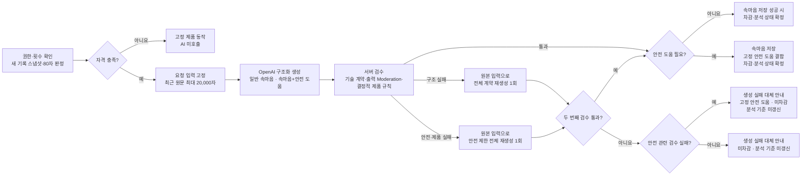

# Pebbling 속마음 엿보기 AI 호출 구조 결정 기록

## 문서 역할

- 결정일: 2026-07-22
- 결정 상태: **v1 기본 호출 구조와 책임 경계 확정**
- 이 문서가 답하는 질문: 왜 서버 규칙과 구조화된 AI 생성 1회를 결합하는가?
- 제품 동작·안전·실패 처리 기준: [제품 구현 명세](01-제품-구현-명세.md)
- 현재 실행 프롬프트: [`observation_prompt_v0.5.0`](observation_prompt_v0.5.0.txt)
- 평가 방법: [AI 평가 판정 기준](../validation/01-AI-평가-판정-기준.md), [AI 평가 실행 가이드](../validation/02-AI-평가-실행-가이드.md)

이 문서는 **선택한 기술 구조와 그 이유**를 보존한다. API 필드명, DB 구조, 클래스·함수명, 라이브러리와 배포 방식은 개발자가 정한다. 제품 동작이 이 문서와 충돌하면 제품 구현 명세를 따른다.

> **기준 코드 상태:** `feature/venting-tab`의
> `fba64161d4f8ba5c78fedc8d5ec2c34416e55b66`에는 구조화 생성, 출력
> Moderation, 두 정상 결과의 공통 finalize, 일시적 기술 오류 재시도가 구현돼
> 있다. v0.5.0 프롬프트·평가기 정렬과 구조 실패·출력 안전/제품 실패의 한정
> 재생성은 아직 남아 있다.

## 1. 결정

v1의 기본 경로는 다음과 같다.

> **서버 생성 자격 확인 → 최근 사용자 원문 구성 → 구조화된 AI 생성 → 서버 검수 → 저장·차감·표시**

핵심 결정은 다음과 같다.

- 이용 권한·횟수·24시간 범위·80자·중복 요청·저장·차감처럼 데이터로 답이 정해지는 조건은 서버가 처리한다.
- 생성 자격을 통과한 요청만 AI를 호출한다.
- 장면 후보 묶기, 선택 장면 결정·정렬, 안전 도움 필요 여부와 속마음 생성은 하나의 구조화된 생성 호출 안에서 처리한다.
- AI의 정상 의미 결과는 `일반 속마음`, `속마음+안전 도움` 두 가지다. 안전 신호만으로 말풍선을 0개로 만드는 경로는 두지 않는다. 고정 안전 도움 문구는 AI가 쓰지 않고 서버·앱이 결합한다.
- v1은 OpenAI 단일 제공사와 하나의 승인된 기본 모델을 사용한다. 다른 OpenAI 모델이나 다른 제공사로 자동 전환하지 않는다.
- OpenAI 출력 Moderation은 속마음 저장 전 별도 분류 호출로 사용한다. 입력 Moderation은 안전 라우팅의 필수 단계로 두지 않으며, Moderation이 Pebbling의 최종 안전 판단을 대신하지 않는다.
- 서버는 구조·허용값·말풍선 수처럼 결정적으로 검사할 수 있는 항목을 저장 전에 검수한다.
- 정상 요청마다 별도 AI judge(결과 재채점용 AI 호출)나 의미 분류 AI를 사용하지 않는다.
- 첫 답변 생성 호출에 실패가 있을 때만 원인에 맞는 두 번째 생성 호출을 최대 1회 허용한다. 일시적 기술 오류는 동일 요청 재시도, 구조 실패는 전체 계약 재생성, 출력 안전·제품 실패는 안전 제한 전체 재생성이다. 출력 Moderation 분류 호출은 이 생성 횟수와 별도로 추적한다.
- 실패한 문장의 일부를 고치는 repair와 품질이 마음에 들지 않는다는 이유의 무작위 재생성은 사용하지 않는다.
- 요청 입력은 생성 중 바뀌지 않도록 논리적으로 고정하되, 이를 이유로 원문을 장기간 복제·보관하지 않는다.
- 속마음이 생성·검수·저장까지 성공하면 즉시 1회를 차감하고 분석 기준을 갱신한다. 화면 열람 여부는 차감 조건이 아니다.

## 2. 이 구조를 선택한 이유

Pebbling은 일반적인 실시간 상담 챗봇과 다르다.

- 사용자가 `속마음 엿보기`를 요청할 때만 AI를 사용한다.
- 여러 시간에 나누어 남긴 기록과 느낌을 함께 볼 수 있다.
- 전체 기록을 요약하기보다 비출 가치가 있는 하나 이상의 장면을 골라 짧은 혼잣말을 만든다.
- 장면 관계, 느낌의 시점, 반응 방향과 문장 생성이 서로 강하게 연결돼 있다.
- 기록 밖 감정·원인·성향을 만드는 오류는 제품 만족도와 안전에 직접 영향을 준다.
- 베타에서는 비용·지연·구현 복잡도를 낮추면서 실제 출력으로 품질을 검증해야 한다.

장면·감정·의도를 먼저 별도 라벨로 확정하면 초기 오분류가 최종 문장까지 전파될 수 있다. 반대로 권한·횟수·글자 수까지 모델에 맡기면 같은 입력에도 제품 상태가 달라질 수 있다. 따라서 **결정적 상태는 서버**, **문맥 의미와 문장 생성은 AI**가 담당하는 구조를 선택했다.

## 3. 대안 비교와 선택 근거

### 3.1 점수 기준

아래 점수는 실험 성능을 측정한 결과가 아니라, **현재 제품 범위와 빠른 베타 출시 조건에 대한 의사결정 점수**다. 높을수록 v1에 적합하다.

| 평가축 | 배점 | 판단 내용 |
|---|---:|---|
| Pebbling 품질 적합성 | 25 | 여러 기록에서 장면을 고르고 자연스러운 속마음을 만드는 데 유리한가 |
| 안전·통제 가능성 | 25 | 안전 경로, 근거 제한과 출력 계약을 일관되게 관리할 수 있는가 |
| 비용·지연 효율 | 15 | 정상 요청당 호출 수·입력 중복·응답 대기 시간이 작은가 |
| v1 구현·운영 단순성 | 15 | 빠르게 구현하고 장애 원인을 추적하기 쉬운가 |
| 가용성·장애 복원력 | 10 | 일부 호출이나 제공사 장애에도 사용자가 결과를 받을 가능성이 높은가 |
| 추적·개선 가능성 | 10 | 실패 유형과 버전을 비교하고 후속 개선하기 쉬운가 |
| **합계** | **100** |  |

실제 Prompt Lab 결과가 쌓이면 품질 통과율, 안전 누락·과잉 전환, 호출 비용과 응답 지연을 같은 테스트 세트에서 측정해 점수를 갱신한다. 한두 개의 좋은 예시만으로 구조를 바꾸지 않는다.

### 3.2 기본 호출 구조 대안

| 대안 | 품질 25 | 안전 25 | 비용·지연 15 | 단순성 15 | 가용성 10 | 개선 10 | 총점 | 결정과 재검토 조건 |
|---|---:|---:|---:|---:|---:|---:|---:|---|
| 자유 형식 생성 1회 | 12 | 8 | 15 | 15 | 6 | 4 | **60** | 제외. 말풍선·안전 상태를 안정적으로 연결하기 어려움 |
| **서버 규칙 + 구조화된 생성 1회** | **22** | **22** | **14** | **13** | **7** | **9** | **87** | **v1 채택**. 결정적 상태는 서버, 장면·문장은 AI가 담당 |
| 분류 AI → 생성 AI | 21 | 23 | 8 | 8 | 5 | 9 | **74** | 안전·장면 분류 실패가 반복되고 별도 분류가 실제로 개선할 때 재검토 |
| 사실·시간 관계 추출 AI → 생성 AI | 23 | 22 | 7 | 7 | 5 | 9 | **73** | 장문에서 사건을 잘못 묶거나 정정·시간 순서를 계속 놓칠 때 재검토 |
| 생성 AI → 상시 AI judge(두 번째 AI가 결과 재채점) | 20 | 23 | 6 | 7 | 5 | 9 | **70** | judge가 사람 판정과 높은 일치도를 보이고 실제 위험 실패를 유의미하게 줄일 때만 재검토 |

현재 채택안은 최고 성능을 영구 보장하는 구조가 아니라, **v1 품질·안전·비용·일정의 균형이 가장 좋은 기준선**이다.

표의 `구조화된 생성 1회`는 **정상 기본 경로**를 뜻한다. 실패한 모든 요청에 상시 두 번째 AI를 붙이는 구조가 아니며, 1장에서 정의한 기술·구조·안전 실패에만 원인별 두 번째 호출을 한 번 허용한다.

## 4. 책임 경계

| 계층 | 책임 |
|---|---|
| 서버 | 생성 자격, 기록 범위와 20,000자 입력 상한, 요청 입력 고정, 전달·제외 범위 추적, 중복 방지, 저장 성공 시 차감·속마음 분석 기준 갱신, 내부 실패 원인, 버전 추적 |
| 주 생성 AI | 기록 조각의 관계, 장면 후보 묶기, 필요한 선택 장면과 표시 순서, 안전 도움 필요 여부, 필요한 표현 제약, 속마음 문장 |
| OpenAI 출력 Moderation | 생성된 속마음의 유해 가능성 신호 제공. `flagged` 결과는 저장·표시하지 않음 |
| 저장 전 서버 검수 | 스키마·허용 상태·말풍선·질문 수·직접 식별정보 반복 등 결정적 항목 확인 |
| 오프라인 평가와 사람 검토 | 근거성, 자연스러움, 구체성, 캐릭터, 질문 부담, 반복과 열람가치 확인 |

### 서버가 의미를 판단하지 않는 영역

다음 항목은 단순 키워드 규칙으로 확정하지 않는다.

- 기록 조각이 의미상 같은 사건인지
- 사용자가 실제로 어떤 감정을 느꼈는지
- 어떤 장면들이 이번 속마음에서 비출 가치가 있는지
- 문장이 자연스럽거나 다시 볼 가치가 있는지
- 미묘한 조언·진단·독점 관계 표현인지

이 영역은 실행 프롬프트와 오프라인 평가를 우선한다. 반복적으로 발생하고 고신뢰 판정 기준이 확인될 때만 추가 런타임 검수를 검토한다.

### 모델 신호와 최종 제품 결과를 분리한다

다음 상태를 하나의 `생성하지 않음`으로 합치지 않는다.

- 80자 미만·횟수 소진·재열람 같은 정상 AI 미호출
- AI가 정상 확정한 `일반 속마음`
- AI가 정상 확정한 `속마음+안전 도움`
- 모델 거절·OpenAI 오류·시간 초과
- 파싱·스키마·제품 규칙 검수 실패와 한정 재생성 결과

모델은 의미 결과나 신호를 반환한다. 서버가 이를 서버 상태와 결합해 화면·저장·차감·분석 상태를 확정한다.

## 5. 실행 프롬프트와 입력 구성

- 제품 구현 명세 전체를 API 입력으로 보내지 않는다.
- 실행 프롬프트는 버전이 있는 단일 원본으로 관리하고 앱 코드 여러 곳에 문자열로 복제하지 않는다.
- 역할·안전·근거·장면·말투 규칙은 관리하기 쉽게 구분하되 실행 시 한 요청으로 조합한다.
- 같은 규칙을 여러 위치에서 반복하지 않는다.
- 정적인 역할과 규칙을 앞에, 매번 달라지는 사용자 기록과 메타데이터를 뒤에 둔다.
- 새 기록 입력 선택과 20,000자 상한은 제품 구현 명세를 따른다. 상한은 항상 채우는 목표가 아니며, 속마음 저장 성공 시 상한 밖 기록까지 다음 속마음으로 넘기지 않는 최근 이야기 중심 정책도 같은 명세를 따른다.
- 이번 속마음 AI에 전달된 기록 ID와 상한 밖으로 제외된 기록 ID를 요청 스냅샷에 구분해 연결하고, 각 범주의 개수·글자 수·시각 범위도 남긴다. 원문을 일반 로그에 복제하지 않는다. 제외 기록 ID는 다음 속마음 대기열이 아니며, 제외된 원문은 삭제하지 않고 주간 편지의 별도 분석 범위에 유지한다.
- 결과 형식은 구조화된 출력으로 받고 서버가 계약을 검사한다.
- Prompt Caching(반복되는 정적 프롬프트 앞부분의 재사용)은 비용·지연 최적화 수단일 뿐, 품질 개선 수단으로 간주하지 않는다.

Few-shot(승인된 입출력 예시를 프롬프트에 포함)은 승인된 실제 출력이 생긴 뒤 예시 없는 버전과 같은 평가 세트로 비교한다. 예시가 반복·감정 단정·질문 과다를 늘리지 않고 품질을 높일 때만 새 프롬프트 버전으로 채택한다.

## 6. 수용한 한계

- 단일 호출은 장문·다중 사건에서 장면을 잘못 묶거나, 여러 장면을 산만하게 나열할 수 있다.
- 20,000자는 6,000자보다 기록 누락을 줄이지만 입력 비용·지연과 긴 문맥의 초점 약화를 늘릴 수 있다. 같은 장문 평가 사례에서 비용·지연·장면 선택 품질을 확인한다.
- 구조화된 출력은 기록 밖 해석이나 부자연스러운 문장을 자동으로 막지 못한다.
- Moderation 통과는 Pebbling의 안전·적합성을 보장하지 않는다.
- 런타임 검수를 최소화하면 일부 의미 품질 문제는 출시 전·후 평가와 사람 검토에서 발견해야 한다.
- 구조·안전·제품 검수 실패는 원인에 맞는 전체 재생성을 한 번 거치지만, 두 번째 결과도 실패하면 개인화 속마음을 표시하지 못할 수 있다.

이 한계는 v1에서 비용·지연·복잡도를 낮추는 대신 평가와 버전 추적을 필수로 두는 선택이다.

## 7. 운영과 개인정보 원칙

- 모델·프롬프트·정책 버전과 처리 결과를 연결해 추적하고 이전 안정 조합으로 되돌릴 수 있어야 한다.
- 요청 입력 고정은 처리 중 일관성을 위한 것이며 원문 장기 보관의 근거가 아니다.
- 일반 로그·오류 추적·분석 도구에 사용자 기록 원문·전체 프롬프트·전체 출력을 남기지 않는다.
- 운영에는 요청·결과 식별자, 처리 원인, 버전, 토큰·비용·지연처럼 필요한 최소 메타데이터를 우선한다.
- 원문 임시 보존, 접근 권한, 삭제, 활성 AI 제공사의 저장·학습 사용 여부와 데이터 공유 설정은 출시 전에 별도로 확인한다.

정확한 저장 위치·TTL(임시 보존 기한)·암호화·접근 권한·삭제 구현은 개발자가 제안하고 제품·개인정보 기준에 따라 확정한다.

## 8. 보류한 개선안과 재검토 조건

다음은 v1에서 제외한 개선 후보다. 승인된 평가 사례에서 같은 실패가 반복되고 프롬프트 수정만으로 줄지 않을 때, 해당 실패 사례만 모은 비교 테스트로 다시 검토한다.

| 개선안 | v1에서 제외한 이유 | 다시 검토할 조건 |
|---|---|---|
| 문장 단위 repair | 실패 문장을 다음 호출에 다시 넣어 새 문제나 의미 변형을 만들 수 있음 | v1에서는 재검토하지 않음. 필요한 경우 원본 입력 전체 재생성의 효과부터 평가 |
| 분류 AI 또는 사실·시간 관계 추출 AI | 호출 수가 늘고 초기 오분류가 생성까지 전파될 수 있음 | 서로 다른 사건을 계속 합치거나 정정·시간 순서·안전 결과 유형을 반복해서 놓침 |
| 생성 AI 뒤 상시 AI judge | 호출 비용·지연이 늘고 judge 자체의 오판을 검증해야 함 | 사람 판정과 높은 일치도를 보이며 실제 안전·정책 실패를 유의미하게 줄임 |
| 모델 라우터 | 모델별 프롬프트·평가·운영 관리가 필요함 | 더 작은 모델이 같은 품질·안전 평가를 통과하고 총비용이나 지연을 줄임 |
| 다른 제공사 자동 전환 | 제공사별 캐릭터·안전·구조화 출력 재검증이 필요함 | 실제 OpenAI 장애로 실패가 반복되고 대체 제공사가 같은 평가 세트를 통과함 |
| RAG·임베딩 | 최근 24시간만 사용하는 현재 범위에는 불필요함 | 장기 기억이나 외부 지식 검색이 제품 범위에 들어옴 |
| 파인튜닝 | 승인 데이터가 충분하지 않음 | 승인 출력이 충분히 누적되고 프롬프트 개선 효과가 정체됨 |

v1의 두 번째 생성은 문장 일부를 고치는 repair가 아니다. 실패한 첫 결과를 폐기하고 같은 원본 스냅샷에서 결과 전체를 다시 만든다. 구조 실패에는 출력 계약만 다시 강조하고, 출력 안전·제품 실패에는 질문·조언·장난·진단·민감 표현 반복을 금지하는 안전 제한 모드를 적용한다. 어느 경우든 두 번째 검수 실패 뒤에는 추가 AI 호출을 하지 않는다.

구조 변경은 비교 테스트에서 안전·품질·비용·지연의 개선이 확인될 때만 채택한다. 결과 한두 개가 마음에 들지 않는다는 이유만으로 호출 단계를 추가하지 않는다.

## 9. 이 기록에서 확정하지 않는 것

- OpenAI 후보 중 출시 기본 모델
- API 필드명과 내부 상태명
- DB·캐시·큐·배포 구조
- 원문 임시 보존의 정확한 TTL
- 고정 안전 도움의 최종 연락처와 경로별 세부 문구

다른 제공사 자동 전환과 장애 요청의 백그라운드 자동 재생성은 v1 범위에서 제외한다. 실제 장애 실패가 반복되고 대체 모델이 같은 평가 기준을 통과했을 때 후속 버전에서 다시 검토한다.

## 10. 참고 근거

### 공식 문서

- [OpenAI Latency optimization](https://developers.openai.com/api/docs/guides/latency-optimization): 불필요한 요청 수를 줄이고 순차 단계를 한 요청으로 결합할 때의 고려사항
- [OpenAI Structured Outputs](https://developers.openai.com/api/docs/guides/structured-outputs): JSON Schema 기반 출력 형식 안정화
- [OpenAI Prompt Caching](https://developers.openai.com/api/docs/guides/prompt-caching): 정적 앞부분과 동적 입력 배치 및 캐시 사용량 확인
- [OpenAI Moderation](https://developers.openai.com/api/docs/guides/moderation): 제공사 유해 콘텐츠 분류 신호
- [OpenAI Under 18 API Guidance](https://developers.openai.com/api/docs/guides/safety-checks/under-18-api-guidance): 미성년 사용자 대상 보호와 고위험 에스컬레이션 고려
- [OpenAI Your data](https://developers.openai.com/api/docs/guides/your-data): API 데이터 보존과 데이터 제어 설정
- [Anthropic Effective context engineering](https://www.anthropic.com/engineering/effective-context-engineering-for-ai-agents): 필요한 맥락을 충분히 제공하면서 불필요한 컨텍스트를 줄이는 원칙

### 연구

- [Lost in the Middle](https://arxiv.org/abs/2307.03172): 긴 입력에서 정보 위치에 따라 실제 활용 성능이 달라질 수 있음
- [When Can LLMs Actually Correct Their Own Mistakes?](https://aclanthology.org/2024.tacl-1.78/): 외부 피드백 없는 자기수정이 일관된 개선을 보장하지 않음
