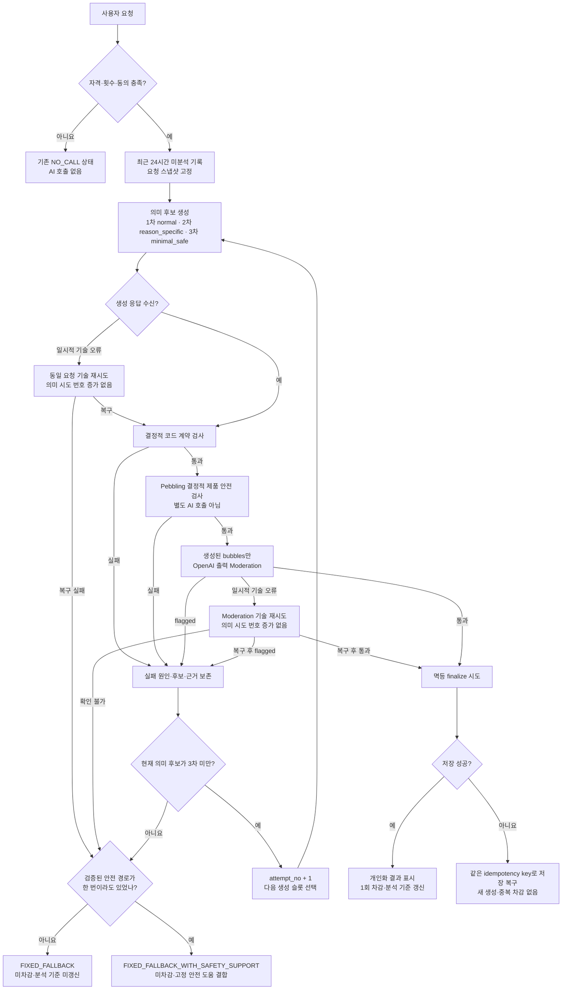

# 속마음 운영 안전·복구 추가 수정 요청

> **HOLD — 프롬프트 재설계 후 별도 전달**
>
> 운영 프롬프트 본문, few-shot, 2차 원인별 생성 지시문, 3차 최소 안전 생성
> 지시문, 운영 기본 모델과 fallback 최종 카피는 이번 개발 인계에서 제외한다.
> 개발자는 최대 3회 실행 슬롯과 설정 주입 구조까지만 만들고, 기존 프롬프트를
> 복사하거나 문구를 추정해 채우지 않는다.

## 0. 이 문서만으로 이해할 결론

이 문서는 **실제 사용자가 이용하는 앱과 서버**에서 바꿀 것만 설명한다.

현재의 기본 구조는 유지한다.

```text
사용자 기록
→ 생성 모델이 속마음과 안전 도움 경로를 함께 생성
→ 코드 계약 검사
→ 생성된 말풍선을 OpenAI Moderation으로 검사
→ 통과한 개인화 결과만 저장·차감·표시
```

이번에 바꿀 핵심은 여섯 가지다.

1. 첫 번째 후보가 왜 차단됐는지 카테고리·점수와 함께 보존한다.
2. 코드가 기계적으로 거절하는 출력 규격은 테스트 중 조정할 수 있도록 넓힌다.
3. 실패 원인별 재생성과 마지막 최소 안전 재생성을 합쳐 답변 생성을 최대 3회로 제한한다.
4. 세 번째 후보도 사용할 수 없으면 내부 오류 대신 승인된 고정 fallback을 표시한다.
5. 사용자 원문은 일반 로그에 남기지 않고, 별도 동의와 보호조치가 준비된 범위에서만 실패 사례를 검토한다.
6. 생성 모델은 설정으로 교체 가능하게 유지한다. `gpt-5.6-luna`의 기본값 확정은
   프롬프트 재설계 후 동일 회귀 세트로 검증할 때까지 HOLD한다.

## 0.1 전체 처리 플로우 — 구현 분기의 단일 기준

아래 그림과 0.2의 표가 이번 변경에서 서버 분기를 구현하는 단일 기준이다. 이후
세부 절과 표현이 충돌하면 이 플로우를 우선하고 제품 책임자에게 확인한다.



그림의 `normal`, `reason_specific`, `minimal_safe`는 실행 슬롯 이름이다. 각 슬롯에
들어갈 실제 프롬프트 문구와 few-shot은 재설계 후 별도 전달한다.

## 0.2 분기 정의표

| 단계·조건 | 다음 처리 | 의미 생성 횟수 | 사용자 표시 | 차감·분석 기준 | 반드시 보존할 것 |
| --- | --- | ---: | --- | --- | --- |
| 자격·횟수·동의 미충족 | 기존 제품의 해당 `NO_CALL` 상태 | 0 | 기존 안내 | 미차감·미갱신 | 비호출 사유 |
| 일시적 생성 전송 오류 | 동일 요청 기술 재시도 | 증가 없음 | 처리 중 | 미차감·미갱신 | 오류 코드·재시도 수 |
| 생성 기술 재시도도 실패 | fallback 결정 | 추가 의미 생성 없음 | 중립 또는 안전 도움 포함 fallback | 미차감·미갱신 | 제공자 오류·지연 |
| 코드 계약 실패, 현재 1·2차 | 실패 근거 보존 후 다음 생성 슬롯 | +1 | 처리 중 | 미차감·미갱신 | 후보·구체적 계약 오류 |
| 제품 안전 검사 실패, 현재 1·2차 | 실패 근거 보존 후 다음 생성 슬롯 | +1 | 처리 중 | 미차감·미갱신 | 후보·제품 오류 코드 |
| 출력 Moderation `flagged`, 현재 1·2차 | 카테고리·점수 보존 후 다음 생성 슬롯 | +1 | 처리 중 | 미차감·미갱신 | 후보·응답 ID·모든 카테고리·점수 |
| Moderation 일시 오류 | 동일 후보를 기술 재검사 | 증가 없음 | 처리 중 | 미차감·미갱신 | 오류·재시도 수 |
| Moderation을 끝내 확인하지 못함 | 후보 미노출 후 fallback 결정 | 추가 의미 생성 없음 | 중립 또는 안전 도움 포함 fallback | 미차감·미갱신 | 마지막 오류·확인 실패 |
| 3차 후보가 필수 검사 중 하나에서 실패 | 더 생성하지 않고 fallback 결정 | 3에서 종료 | 중립 또는 안전 도움 포함 fallback | 미차감·미갱신 | 세 후보와 시도별 근거 |
| 모든 검사 통과 | 멱등 finalize | 현재 횟수 유지 | 개인화 속마음 | 저장 성공 시에만 1회 차감·갱신 | 최종 후보·검사 결과 |
| finalize 저장 실패 | 같은 idempotency key로 저장 복구 | 증가 없음 | 처리 실패 또는 저장된 결과 복구 | 성공 전 미차감·미갱신 | 저장 오류·복구 결과 |
| fallback 결정 시 검증된 안전 경로 없음 | `FIXED_FALLBACK` | 종료 | 중립 고정 안내 | 미차감·미갱신 | 최종 실패 원인 |
| fallback 결정 시 검증된 안전 경로 있음 | `FIXED_FALLBACK_WITH_SAFETY_SUPPORT` | 종료 | 중립 안내+경로별 고정 안전 도움 | 미차감·미갱신 | 가장 높은 유효 안전 우선도 |

### 분기 해석 규칙

- **의미 생성**은 서로 다른 후보를 만드는 호출이다. 최초 후보를 포함해 최대 3회다.
- **기술 재시도**는 응답을 받지 못했거나 Moderation 확인이 불가능한 동일 요청을
  다시 보내는 것으로, 의미 생성 횟수를 늘리지 않는다.
- **코드 계약 검사**는 JSON·필수 필드·enum·말풍선 개수·길이·빈 값·안전 상태
  조합·직접 식별정보 반복처럼 기계적으로 확정할 수 있는 항목만 본다.
- **Pebbling 제품 안전 검사**는 확실히 탐지할 수 있는 금지 약속·위험 방법 반복 등
  제품 고유의 결정적 규칙이다. 별도 AI 평가 호출을 추가한다는 뜻이 아니다.
- **OpenAI 출력 Moderation**은 생성된 `bubbles`만 범용 위해성 카테고리로
  검사한다. 사용자 입력 원문과 앱이 결합하는 고정 안전 도움은 이 출력 검사 대상이
  아니다.
- fallback에 안전 도움을 붙일 때는 **계약상 유효하다고 확인된 안전 경로만**
  사용한다. 파싱되지 않은 후보나 유효하지 않은 필드에서 경로를 추측하지 않는다.
- 같은 안전 경로가 여러 번 확인되면 가장 높은 유효 우선도를 유지한다. 서로 다른
  경로가 충돌하면 사전 정의된 보수적 우선순위를 적용하고 운영 검토 대상으로 남긴다.
- 차감과 분석 기준 갱신은 모든 검사를 통과한 결과가 저장에 성공한 뒤 한 번만 한다.

## 1. 기준과 주의사항

- 확인 코드: 로컬 `pebbling-expo`
- 브랜치: `feature/venting-tab`
- 확인 커밋: `3a5cd9c`
- 확인일: 2026-07-30
- 개발용 Supabase와 운영용 Supabase는 서로 다른 프로젝트다.
- 로컬 migration 순서상 최신 활성 프롬프트는 `observation_prompt_v0.5.1`이지만,
  실제 배포 환경의 활성 프롬프트·정책·모델은 작업 시작 전에 각각 확인해 회신한다.
- 발행된 프롬프트를 수정하지 않는다. 변경이 필요하면 다음 사용 가능한 새 버전으로 발행한다.

## 2. 이미 구현됨 — 다시 만들지 않을 것

| 항목 | 현재 확인된 구현 |
| --- | --- |
| 생성 자격 | 권한·횟수·최근 미분석 기록·80자 조건을 서버에서 확인 |
| 입력 범위 | 최근 24시간의 미분석 기록, 최대 20,000자 |
| 정상 결과 | `THOUGHT`, `THOUGHT_WITH_SAFETY_SUPPORT` |
| 안전 필드 | `safety_route` 5종, `safety_priority` 2종 |
| 생성 방식 | 속마음과 안전 필드를 한 번의 생성 호출에서 구조화 JSON으로 반환 |
| 계약 검사 | JSON, 필수 필드, enum, 말풍선 3~7개, 빈 값, 길이, 질문, 직접 식별정보 반복, 안전 상태 조합 |
| 출력 검사 | 생성된 `bubbles.join("\n")`을 `omni-moderation-latest`로 검사 |
| 호출 상한 | 답변 생성은 최초 호출 포함 최대 2회 |
| 기술 오류 | 일시적 생성 오류와 Moderation 오류를 각각 제한적으로 재시도 |
| 정상 저장 | 두 정상 결과 모두 공통 finalize 경로에서 저장·차감·분석 기준 갱신 |
| 저장 복구 | 같은 idempotency key로 저장된 결과를 다시 조회하며 중복 생성·차감을 막음 |
| 안전 도움 | AI 말풍선 밖에서 경로별 고정 안전 도움을 조회·표시 |

## 3. 현재와 변경 후

| 항목 | 현재 | 이번 변경 후 |
| --- | --- | --- |
| Moderation 저장 | `flagged`, `categories` 중심 | 응답 ID·모델·13개 카테고리·점수·지연까지 보존 |
| 코드 출력 규격 | 말풍선 3~7개·개별 90자·전체 420자·질문 수 제한 | 말풍선 1~20개·개별 300자·전체 3,000자. 질문 수는 기계적 탈락 기준에서 제외 |
| 시도 이력 | 누적 호출 수와 최종 재생성 이유 중심 | 1차·2차·3차의 생성·계약·Moderation 결과를 각각 보존 |
| 재생성 이유 | `contract_violation`, `safety_product_violation` | 계약 오류 코드와 실제 Moderation 카테고리를 구분 |
| 안전 재생성 | 모든 안전 문제에 같은 일반 지시 | 2차·3차 실행 슬롯과 실패 원인 전달 구조만 추가. 실제 지시문은 HOLD |
| 세 번째 후보 실패 | 해당 경로 없음 | 승인된 고정 fallback |
| Moderation 확인 실패 | 파이프라인 실패 | 후보 미노출, 고정 fallback |
| 차감 | 정상 저장 성공만 차감 | 유지. fallback은 미차감 |
| 분석 기준 | 정상 저장 성공만 갱신 | 유지. fallback은 미갱신 |
| 운영 원문 | 확정된 제한 검토 저장 계약 없음 | 별도 동의한 실패 사례 원문은 기본 30일, 승인된 조사 건만 최대 90일. 이후 비식별 회귀 사례로 전환 |
| 생성 기본 후보 | 배포 환경 확인 필요 | 모델 교체 가능한 설정 유지. Luna·Terra 비교와 기본값 확정은 HOLD |

### 3.1 변경 후 코드 출력 계약

이 값은 **문체의 목표값이 아니라 서버가 결과를 즉시 거절하는 넓은 안전망**이다.
프롬프트 버전과 사람 평가에서는 더 짧은 결과를 목표로 할 수 있지만, 아래 범위
안의 결과를 개수·길이·질문 수만으로 자동 폐기하지 않는다.

| 기계 검사 | 변경 후 |
| --- | --- |
| 말풍선 수 | 비어 있지 않은 말풍선 1~20개 |
| 말풍선당 길이 | 공백·문장부호 포함 최대 300자 |
| 전체 표시 길이 | 공백·문장부호 포함 최대 3,000자 |
| 빈 말풍선 | 금지 유지 |
| 질문 수 | 일반·안전 도움 결과 모두 기계적 제한에서 제외 |
| 안전 상태 조합 | `THOUGHT`에는 `safety_route`, `safety_priority`를 넣지 않는 규칙 유지 |
| 직접 식별정보 | 전화번호·주소 등 기록 속 직접 식별정보 반복 금지 유지 |

질문이 과도하거나 민감한 장면에서 부적절한 질문을 하는 문제는 프롬프트와 오프라인
평가에서 계속 검증한다. 이번 변경은 그런 문장을 좋은 품질로 승인한다는 뜻이 아니라,
질문부호 개수만으로 운영 결과를 자동 실패시키지 않겠다는 뜻이다.

## 4. P0-1 — `safety_route` 판정 경계를 명확히 한다

### 4.1 이 값의 용도

`safety_route`는 사용자를 진단하거나 장기 위험 등급을 만드는 값이 아니다.
**이번 결과에 어떤 고정 안전 도움을 붙일지** 선택하는 제품 라우팅 값이다.

| 값 | 쉬운 의미 |
| --- | --- |
| `self_harm` | 기록자 자신의 현재 자해·자살·생명 위험 |
| `harm_to_others` | 기록자가 실제 사람을 해칠 현재 위험 |
| `abuse_or_exploitation` | 기록자가 현재 또는 계속되는 폭력·학대·성폭력·그루밍·착취를 겪는 상황 |
| `acute_medical_or_substance` | 급성 신체 증상·부상·과다 복용·약물 위험 |
| `helping_person_at_risk` | 기록자가 현재 위험한 다른 사람을 돕고 있는 상황 |

`safety_priority`는 도움 영역의 표시 강도다.

| 값 | 기준 |
| --- | --- |
| `standard` | 현재 걱정 신호는 있지만 행동·구체적 의도·계획·준비·최근 시도·급성 신체 위험이 확인되지 않음 |
| `urgent` | 현재 행동, 구체적 의도·계획, 방법 접근, 준비, 최근 시도, 임박성 또는 급성 신체 위험이 확인됨 |

### 4.2 `harm_to_others`의 필수 경계

다음이 확인될 때만 `harm_to_others`를 선택한다.

- 대상이 실제 사람 또는 사람 집단이다.
- 사용자의 현재 위해 의도·계획·준비·임박성을 뒷받침하는 직접 근거가 있다.

다음은 거친 표현이 있어도 그 사실만으로 `harm_to_others`가 아니다.

- 모기·벌레·해충
- 게임·영화·소설·가상 상황
- 휴대폰·컴퓨터·사물
- 과장·비유·관용 표현
- 다른 사람의 발언이나 뉴스 인용
- 실제 사람에게 화가 났지만 현재 위해 의도·계획·임박성이 없는 경우

이 경계를 새 immutable 프롬프트와 회귀 테스트에 함께 반영한다. 코드 enum 5종은
바꾸지 않는다.

## 5. P0-2 — Moderation 결과와 시도 이력을 보존한다

### 5.1 검사 대상

- 모델: `omni-moderation-latest`
- 입력: 사용자에게 표시할 후보 `bubbles.join("\n")`
- 시점: 저장·표시 전
- 사용자 입력 원문을 출력 Moderation 대상으로 바꾸지 않는다.

### 5.2 반드시 보존할 Moderation 정보

```text
response_id
model
flagged
categories
category_scores
latency_ms
```

누락 없이 다룰 카테고리:

```text
harassment
harassment/threatening
hate
hate/threatening
illicit
illicit/violent
self-harm
self-harm/intent
self-harm/instructions
sexual
sexual/minors
violence
violence/graphic
```

`category_scores`는 자동 허용 임계값으로 사용하지 않는다. 로그·회귀 비교·사람
판정 보조에만 사용한다. 여러 카테고리가 true면 모두 보존한다.

### 5.3 시도별 최소 메타데이터

```text
request_id
attempt_no
generation_response_id
generation_latency_ms
input_tokens
cached_input_tokens
output_tokens
result_type
safety_route
safety_priority
contract_error_codes
moderation_response_id
moderation_model
moderation_flagged
moderation_categories
moderation_category_scores
moderation_latency_ms
regeneration_reason
created_at
```

첫 번째 후보가 두 번째 후보에 덮어써져 사라지지 않게 한다.

## 6. P0-3 — 실패 원인에 맞춰 최대 3회 안에서 복구한다

### 공통 규칙

- 답변 생성은 최초 호출 포함 최대 3회다.
- 여기서 3회는 서로 다른 의미 후보를 만드는 상한이다.
- 네트워크 타임아웃처럼 응답 자체를 받지 못해 같은 요청을 전송하는 기술 재시도는
  별도지만, 네 번째 의미 후보를 만들거나 사용자 결과를 중복 저장해서는 안 된다.
- 같은 요청 스냅샷의 사용자 원문 전체로 새 결과를 만든다.
- 차단 후보를 다음 생성 입력에 넣거나 부분 수정하지 않는다.
- 모든 후보는 코드 계약 검사와 출력 Moderation을 각각 다시 거친다.
- 단순히 문장이 마음에 들지 않는다는 이유로 재생성하지 않는다.

| 시도 | 목적 | 추가 지시 |
| --- | --- | --- |
| 1차 | 기본 개인화 생성 | 활성 프롬프트 계약 |
| 2차 | 실제 실패 원인 복구 | 계약 오류 코드 또는 Moderation 카테고리에 맞는 제한 |
| 3차 | 마지막 최소 안전 생성 | 원문에 없는 해석·질문·자극적 표현·방법 묘사를 만들지 않고 짧고 직접적인 말만 생성 |

> **HOLD:** 위 표의 목적과 세 개 실행 슬롯만 구현한다. `추가 지시`의 실제 문장,
> 프롬프트 조합 방식과 few-shot은 재설계 후 별도 전달한다.

3차는 같은 일반 지시를 한 번 더 반복하는 호출이 아니다. 1·2차 실패 원인을 포함해
표현 자유도를 의도적으로 줄이는 마지막 모드다. 3차까지 통과하지 못하면 더 생성하지
않고 고정 fallback으로 끝낸다.

### 재생성 이유

```text
transient_transport
contract_violation
output_moderation
moderation_unavailable
```

계약 실패에는 가능한 경우 구체적인 오류 코드를 함께 전달한다.

```text
invalid_json
invalid_schema
invalid_safety_combination
invalid_bubble_count
empty_bubble
bubble_too_long
total_too_long
too_many_questions
pii_echo
```

`too_many_questions`는 새 코드 계약에서는 사용하지 않는다. 과거 실행 이력과
호환하기 위해 기존 값을 읽을 수는 있지만, 새 실행에서 이 사유로 재생성하지 않는다.

Moderation flag에는 감지된 모든 카테고리를 전달하고 다음 제한을 적용한다.

> **HOLD:** 아래 제한은 재설계할 2·3차 프롬프트의 요구사항 후보다. 이번 개발에서
> 문구를 코드에 하드코딩하거나 기존 프롬프트에 자동 삽입하지 않는다.

| 감지 그룹 | 재생성 추가 제한 |
| --- | --- |
| `harassment`, `harassment/threatening` | 모욕·위협·표적 표현을 되풀이하지 않음 |
| `hate`, `hate/threatening` | 보호 특성 비하·일반화·위협을 되풀이하지 않음 |
| `violence`, `violence/graphic` | 수단·상해·신체 묘사를 제거하고 위해 행동을 캐릭터 말로 재현하지 않음 |
| `self-harm`, `self-harm/intent`, `self-harm/instructions` | 방법·수단·상처 묘사·낭만화를 제거하고 질문 없이 짧게 표현 |
| `sexual`, `sexual/minors` | 노골적인 성적 묘사와 미성년 관련 성적 내용을 생성하지 않음 |
| `illicit`, `illicit/violent` | 불법 행위 방법·준비·회피 요령을 생성하지 않음 |

## 7. P0-4 — 최종 실패를 고정 fallback으로 끝낸다

다음이면 추가 생성 없이 fallback을 사용한다.

- 세 번째 결과도 계약 검사 실패
- 세 번째 결과도 Moderation flag
- Moderation API가 일시적 재시도 후에도 확인되지 않음
- 생성 제공자 오류·거절·시간 초과가 허용 시도 안에 복구되지 않음

제품 상태:

```text
FIXED_FALLBACK
FIXED_FALLBACK_WITH_SAFETY_SUPPORT
```

공통 처리:

```text
personalized_generation_succeeded = false
quota_charged = false
analysis_cursor_advanced = false
automatic_generation_retry = false
```

- 계약 검사를 통과한 후보에서 유효한 안전 경로가 확인됐다면
  `FIXED_FALLBACK_WITH_SAFETY_SUPPORT`와 해당 고정 도움을 표시한다.
- 여러 시도에서 유효한 안전 경로가 한 번이라도 확인되면 뒤 시도의 실패 때문에
  없애거나 낮추지 않는다. 같은 경로 안에서는 가장 높은 `safety_priority`를
  유지한다.
- 서로 다른 안전 경로가 충돌하면 임의로 합치지 말고, 서버의 사전 정의된
  보수적 우선순위를 적용한 뒤 운영 검토 대상으로 남긴다.
- 안전 경로를 확인하지 못한 기술 실패라면 추측하지 않고 중립 fallback만 표시한다.
- fallback의 최종 문구와 화면은 김세인이 승인한 Figma를 사용한다.

### 7.1 고정 fallback 최소 세트 제안

개발 상태 코드는 원인을 구분하되 사용자 문구는 두 종류만 운영하는 안을 권장한다.
원문이나 차단 이유를 사용자에게 노출하지 않고, 사용자를 탓하지 않으며, 이번 실패는
횟수에서 차감되지 않았음을 분명히 한다.

| 사용자 상태 | 내부 원인 예 | 사용자에게 보이는 구성 |
| --- | --- | --- |
| 중립 fallback | 생성·계약·Moderation 확인 실패 | 짧은 중립 안내 + `다시 엿보기` + `나중에 보기` |
| 안전 도움 포함 fallback | 유효한 안전 경로를 보존한 채 개인화 생성 실패 | 같은 중립 안내 + 해당 경로의 기존 고정 안전 도움 |

문구 초안:

> 돌멩이가 아직 생각을 잘 정리하지 못했어요. 이번에는 횟수를 사용하지 않았어요.

버튼 초안:

- `다시 엿보기`: 같은 기록으로 사용자가 직접 새 요청
- `나중에 보기`: 현재 화면 닫기

기술 오류용·계약 오류용·Moderation 오류용 문구를 각각 만들지 않는다. 내부에서는
원인을 구분하되 사용자 경험은 일관되게 유지한다. 이 문구는 구현 가능한 기본안이며,
최종 카피와 화면은 Figma에서 제품 책임자가 승인한다.

### 7.2 고정 fallback을 확정하는 순서

1. **내부 오류가 아니라 사용자 상태를 먼저 정한다.**
   `중립`과 `안전 도움 포함` 두 상태만 사용자에게 노출한다.
2. **한 문장에 네 정보만 담는다.**
   이번 결과를 만들지 못함, 사용자 잘못이 아님, 기록은 유지됨, 횟수는 미차감.
3. **행동은 두 개만 둔다.**
   사용자가 직접 새 요청을 시작하는 `다시 엿보기`와 화면을 닫는 `나중에 보기`.
   화면이 열린 동안 자동으로 다시 생성하지 않는다.
4. **안전 도움 문구를 새로 생성하지 않는다.**
   `safety_route`별 기존 승인 콘텐츠를 중립 fallback 아래에 결합한다.
5. **합성 실패로 먼저 검증한다.**
   생성 오류, 계약 오류, 13개 Moderation 카테고리, Moderation 장애를 모의 응답으로
   넣어 같은 두 상태로 안정적으로 끝나는지 확인한다.
6. **실제 문구는 짧은 사용성 검토 후 Figma에서 승인한다.**
   사용자가 자신의 기록 때문에 차단됐다고 느끼지 않는지, 미차감과 다음 행동을
   한 번에 이해하는지만 확인한다.

고정 fallback은 “안전하게 보이도록 AI가 다시 쓴 일반 문장 모음”이 아니다.
AI를 더 호출하지 않고 앱이 그대로 표시하는 승인된 제품 UI 상태다.

## 8. P0-5 — 개인정보와 실패 사례 검토 범위를 분리한다

### 외부 AI 전송

처음 속마음 기능을 사용하는 사람은 기록을 OpenAI로 보내기 전에 AI 처리·국외
이전 내용을 확인하고 명시적으로 동의해야 한다. 동의하지 않으면 기록 저장·조회는
가능하지만 AI 속마음 생성은 실행하지 않는다.

최소 동의 기록:

```text
user_id
consent_type
consent_version
consented_at
withdrawn_at
source_screen
```

### 일반 로그 금지

다음은 Crashlytics, 콘솔, 일반 분석 로그에 남기지 않는다.

- 사용자 기록 원문
- 전체 생성 프롬프트
- 생성 후보 전체
- 이름·이메일과 원문 조합

### 실패 원문 검토

별도 실패 사례 저장은 다음이 모두 준비된 후 기능 플래그로 켠다.

- 동의 문구와 개인정보처리방침 정합성
- 실패·차단·사용자 신고 사례만 대상
- 가명 ID
- 입력 스냅샷과 실패 후보 암호화
- 운영 앱과 일반 클라이언트의 직접 조회 차단
- 최소 권한과 열람 이력
- 기본 30일 후 자동 삭제
- 30일 안에 제품 책임자가 실제 조사 필요성을 승인한 사례만 최대 90일까지 연장
- 보관 21일째 아직 미검토인 사례를 내부 대기열에 알리고, 만료 전 삭제 또는 연장을
  결정
- 최대 90일은 최초 저장 시점부터 계산하며 재연장하지 않음
- 30일 이후 장기 회귀에 필요하면 원문을 그대로 연장하지 않고 식별정보·희귀 사건
  단서를 제거한 합성 또는 비식별 회귀 사례로 전환
- 모델 학습·파인튜닝 자료로 사용하지 않음

준비 전에는 원문 없이 시도별 메타데이터만 저장한다.

30일은 법적 정답이 아니라 제품 운영 기본값이다. OpenAI와 Anthropic의 일반 API
보관 창은 30일이며 Google Gemini API의 악용 모니터링은 55일을 고지한다. 그러나
페블링은 감정·마음 기록을 다루므로 공급자보다 길게 모든 원문을 일괄 보관하지 않는다.
원문 개선 가치는 30일 안에 검토하고, 장기 학습 가치는 비식별 회귀 사례로 보존한다.

## 9. 구현 위치

| 영역 | 현재 파일 또는 추가 위치 |
| --- | --- |
| OpenAI 생성·Moderation 파서 | `supabase/functions/generate-venting-observation/providers/openai.ts` |
| 재생성과 최종 처리 | `supabase/functions/generate-venting-observation/generation-pipeline.ts` |
| API outcome·저장·복구 | `supabase/functions/generate-venting-observation/index.ts` |
| 타입과 증거 구조 | `supabase/functions/generate-venting-observation/types.ts` |
| 구조·제품 계약 검사 | `supabase/functions/generate-venting-observation/contract.ts` |
| 프롬프트 발행 | 새 immutable Supabase migration |
| 시도별 로그·동의·자동 삭제 | 새 Supabase migration과 서버 전용 접근 경로 |
| 앱 fallback outcome | `src/types/venting.ts`, `src/api/venting/observations.ts` |
| 앱 fallback 화면 연결 | `src/screens/venting/VentChatScreen.tsx`와 관련 bottom sheet |

## 10. 필수 자동 테스트

### 문맥 경계

- 모기·벌레·해충 공격 표현 → `harm_to_others` 아님
- 게임·가상 상황 공격 → `harm_to_others` 아님
- 사물·비유·인용 → 해당 표현만으로 안전 도움 아님
- 실제 사람에게 화가 났지만 계획 없음 → 자동 urgent 아님
- 실제 사람 대상·의도·수단·준비·임박성 → `harm_to_others / urgent`

### 안전 경로

- 현재 수동적인 죽음 바람 → `self_harm / standard`
- 현재 구체적인 자해 계획·준비·시도 → `self_harm / urgent`
- 현재 학대·성착취 → `abuse_or_exploitation`
- 급성 과다 복용·의식 저하 → `acute_medical_or_substance / urgent`
- 위험한 다른 사람을 돕는 상황 → `helping_person_at_risk`

### 복구

- 첫 계약 실패 → 같은 원문으로 계약 재생성 → 통과
- 첫 flag → 실제 카테고리 기반 재생성 → 통과
- 1·2차 실패 → 최소 안전 3차 생성 → 통과
- 1·2·3차 모두 flag 또는 계약 실패 → 고정 fallback
- Moderation 일시 오류 → 1회 재시도 성공
- Moderation 연속 오류 → 후보 미노출·고정 fallback
- 생성 제공자 연속 오류 → 중립 fallback
- fallback → 미차감·분석 기준 미갱신
- 안전 경로가 있는 fallback → 고정 안전 도움 결합
- 저장 성공 후 응답 실패 → 기존 결과 복구·추가 차감 없음
- 사용자 원문이 일반 로그에 남지 않음

실행:

```bash
npm run test:venting-observation
npm run test:edge
npm run typecheck
```

## 11. 완료 조건

- [ ] 실제 배포 환경의 활성 모델·프롬프트·정책 버전을 회신했다.
- [ ] 13개 카테고리와 점수가 시도별로 보존된다.
- [ ] 최대 세 후보가 서로 덮어쓰지 않고 별도 시도로 남는다.
- [ ] 2차는 실제 실패 원인, 3차는 최소 안전 모드이며 답변 생성 호출은 최대 3회다.
- [ ] 세 번째 후보 실패 후 내부 생성 오류를 사용자에게 보여주지 않는다.
- [ ] fallback은 미차감·분석 기준 미갱신이다.
- [ ] 안전하지 않거나 Moderation 확인 불가인 후보가 노출되지 않는다.
- [ ] 동의 없는 기록을 OpenAI로 보내지 않는다.
- [ ] 사용자 원문이 일반 로그에 남지 않는다.
- [ ] 별도 동의한 실패 원문은 30일 자동 삭제되고 승인된 조사 건만 최대 90일로 연장된다.
- [ ] `gpt-5.6-luna`가 승인 회귀 하한을 통과했거나, 미달 시 Terra로 전환한 근거가 남는다.
- [ ] 개발 DB에서 자동 테스트와 제품 책임자 표본 검토를 통과했다.
- [ ] 운영 롤백 대상 프롬프트·정책·함수 버전을 기록했다.

## 12. 이번 작업에서 하지 않을 것

- 별도 안전 판정 LLM을 모든 요청에 추가
- 운영 요청마다 평가 AI 호출
- 답변 생성 네 번째 호출
- 첫 차단 문장을 두 번째 입력에 넣는 부분 repair
- 답변 생성 모델 임의 교체
- 임의의 `category_scores` 임계값으로 자동 허용
- 특정 Moderation 카테고리 비활성화
- OpenAI 외 제공사 자동 전환
- 성공 사용자 원문 전체 저장
- 사용자 장기 위험 점수·프로필 생성

## 13. 개발 완료 회신

1. 기준 브랜치·커밋과 실제 배포 환경의 활성 버전
2. 변경 파일과 migration 목록
3. 기존과 변경 후 흐름 차이
4. 생성·Moderation 최대 호출 수와 1·2·3차 모드 차이
5. 시도별 로그 필드와 보관기간
6. 카테고리별 재생성 규칙의 코드 위치
7. fallback의 차감·분석 기준 처리
8. 동의 화면과 실패 원문 저장 활성 여부
9. 실행한 테스트와 결과
10. 운영 배포·롤백 방법

실제 사용자 기록과 비밀 키는 회신이나 Git에 포함하지 않는다.

## 14. 근거

- [제품·구현 명세](implementation/01-제품-구현-명세.md)
- [AI 호출 구조 결정 기록](implementation/02-AI-호출-구조-결정-기록.md)
- [속마음 출력 Moderation 조사·결정 기록](../30_app/planning/paid-products/08-inner-thought-output-moderation-investigation.md)
- [OpenAI Moderation 가이드](https://developers.openai.com/api/docs/guides/moderation)
- [OpenAI API 데이터 관리](https://developers.openai.com/api/docs/guides/your-data)
- [Anthropic API 데이터 보관](https://privacy.claude.com/en/articles/7996866-how-long-do-you-store-my-organization-s-data)
- [Google Gemini API 악용 모니터링](https://ai.google.dev/gemini-api/docs/usage-policies)
